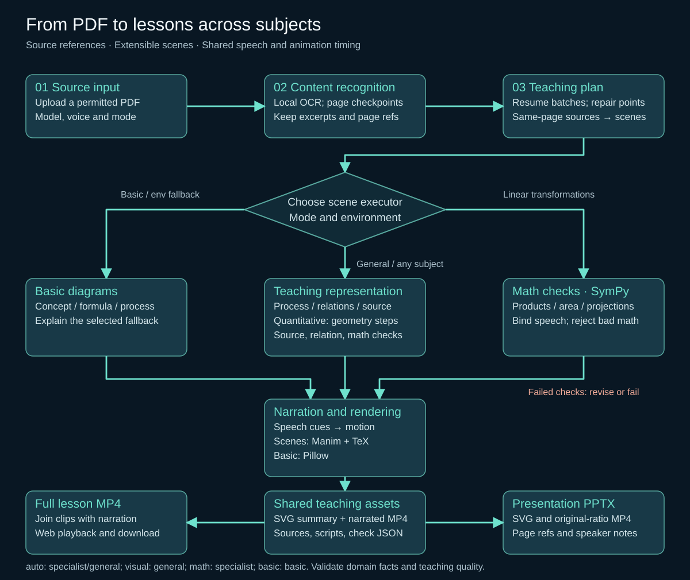

# Zhijiang Agent (Book2Course)

**Language / 语言:** [简体中文](README.md) | [English](README.en.md)

Convert textbooks, notes and knowledge PDFs you have permission to use into Chinese teaching videos and PPTX courseware with source references. The pipeline supports text extraction, local OCR, course planning, scripts, SVG diagrams, speech and video assembly. The website shows scripts, PDF pages, quotations and knowledge relations, with MP4, PPTX and scene data downloads.

**Real AI mode** uses local Ollama or a compatible service. **Deterministic demo mode** needs no model or key and is explicitly labelled as rule-generated. Source matching, model review and computation checks have limited scopes; teaching content still needs human review.

## Quick start (Windows)

Run from the repository root:

```powershell
python -m venv .venv
.\.venv\Scripts\python -m pip install -e ".[test]"
.\.venv\Scripts\python -m uvicorn zhijiang.main:app --host 127.0.0.1 --port 8765
```

Open [http://127.0.0.1:8765/](http://127.0.0.1:8765/), select the [original sample PDF](examples/binary_search_original.pdf), confirm rights, and try demo mode with Windows system speech. Review the script, sources, video and slides. **Press `Ctrl+C` in the server terminal to stop it**; closing the browser does not stop the service.

Python 3.11+ is required; Python 3.13 has been verified. System narration requires Windows Chinese speech; other environments can use a compatible speech API. `imageio-ffmpeg` supplies FFmpeg, so a system installation is unnecessary.

## Model and animation configuration

Copy the template for initial setup. If `.env.local` exists, edit it to preserve your settings:

```powershell
Copy-Item .env.local.example .env.local
ollama list
```

Set `ZHIJIANG_LLM_MODEL` to an installed model, start Ollama, and restart the web service. Mathematical object mode requires image input; the local model is `qwen3.5:9b`, with `ZHIJIANG_OLLAMA_SEMANTIC_THINKING=true` recommended. `.env.local`, model weights, uploads and generated artifacts are ignored by Git. The website also accepts per-job settings. External services require consent to send text, mathematical page images or narration; job keys remain only in process memory.

Optional `ZHIJIANG_OLLAMA_NUM_GPU` controls GPU layer allocation; leave it empty for Ollama's automatic allocation. This 8GB desktop uses `24` to preserve memory headroom while other applications run; adjust it to your hardware. Mathematical construction calls use a 16K context. Speed depends on available GPU memory, RAM and the model.

`ZHIJIANG_OLLAMA_THINKING_LEVEL` selects a reasoning level actually advertised by the service; leave it empty for the service default. Unsupported levels fail explicitly. Models with only a Boolean thinking switch continue to use `ZHIJIANG_OLLAMA_SEMANTIC_THINKING`. Results with different models, levels or hardware are not an intrinsic model ranking.

```powershell
.\.venv\Scripts\python -m pip install -e ".[math-animation]"
```

| Animation mode | Current behavior |
| --- | --- |
| `auto` | AI default; selects source-based relations, processes, comparisons, annotations or geometry. Falls back to basic diagrams with a reason if the environment is unavailable. |
| `visual` | General scenes; fails explicitly when source or execution checks cannot pass. |
| `geometry` | General 2-D mathematical objects; requires TeX and fails explicitly without relation-graph or page-highlight fallback. |
| `math` | Specialized 2-D linear transformations; requires suitable sources and TeX. |
| `basic` | Basic bullet diagrams; used by deterministic demo mode. |

Native relations and page annotations do not need TeX; computational geometry and specialized math need `latex` and `dvisvgm`. See [configuration and recovery](docs/configuration.en.md) for speech, Kokoro, external APIs and resume; see [teaching diagrams and animations](docs/animations.en.md) for diagrams and skills.

## Natural narration (optional)

Run **Qwen3-TTS 0.6B Base** in a separate `.venv-tts` environment to condition narration on a local reference voice. The website includes a default-voice audition; AI narration is used in videos and PPT slides. Voice prompts, weights, and `.env.local` are Git-ignored. Reference audio and scripts remain local. See [local reference-conditioned speech](docs/configuration.en.md#local-reference-conditioned-speech) for installation, startup, and CPU/GPU settings.

Start speech with `.\scripts\start_voice_service.ps1`; stop it with `Ctrl+C` in its terminal. With `ZHIJIANG_DEFAULT_VOICE_MODE=ai`, new website sessions prefer the configured AI voice. Existing jobs and API calls without a voice mode retain their previous behavior. Judge voice similarity and naturalness by listening to the audition.

## PPT templates and course director

The website offers **Dark Presentation, Paper Explainer, Academic Classroom, and Editorial Story** with layout previews. New templates include a question opener, roadmap, split text/figure layouts, evidence sidebars, captions, and recap pages. Real AI selects allowed layouts, existing bullet IDs, and optional animation pages based on the content; demo mode is explicitly rule-based. Complex mathematical figures retain a large canvas and their existing continuous animation.

New jobs share their template, body layout and illustrations between PPT and the complete MP4. Mathematical scenes retain their continuous motion inside an aspect-preserving viewport. Titles use approximately 36–44 pt and body text at least 24 pt; long text is paginated. Sources, mode and technical labels remain in notes and on the website. Old jobs without `ppt_template` retain `classic`; new website jobs default to `paper`. Arbitrary uploaded PPTX masters are not supported. See [course director and PPT templates](docs/课程导演与PPT模板.md).

New jobs separate speech from screen content. Full narration stays in notes and on the website; compact object labels, example tables, comparisons, sourced arrows and concept diagrams take its place on screen. Every shortened assertion and connector is bound to a complete script sentence and reviewed for conditions, negation and direction. Crowded diagrams change composition. Existing mathematical SVGs and continuous scenes retain priority.

Ordinary AI captions are first grounded in complete narration sentences, then a separate stage designs compact visuals. Full sentences are review evidence, not mandatory screen text. Independently read propositions restore knowledge diagrams; explicit fields and values can become example tables. Unsupported arrows are rejected and recorded. Model review does not establish that the narration itself is correct. Chinese candidate boundaries use `jieba`, now a core dependency; ordinary slides do not require the math-animation extra.

The agent groups the roadmap into at most four consecutive learning themes (at least two for five or more passages, and three for twelve or more) and checks each theme against its actual passages, then independently selects and reviews complete knowledge statements for the ending instead of listing every slide title. Both PPT and new complete videos include a cover and ending. Videos hold the cover for 3 seconds and the ending for 5 seconds with intentional silence, without repeating narration. Existing generated files remain accessible.

## Searchable teaching illustrations

The package includes **100 original line symbols and 9 sourced CC0 hand-drawn illustrations** across agriculture and everyday life, computing, mathematics, physics and engineering, chemistry, biology, education, medicine, finance, law, transport and history. The books retain pencil texture; the watermelon and bulb retain freehand strokes. Authors, origins and licenses are listed beside each sourced asset. Automatic illustration selection is enabled by default. The real model selects at most one primary illustration and two supporting symbols per page from up to eight local candidates, preferring illustrations of the same object; demo mode uses deterministic matching. Pictures are bound to their examples or teaching points and together occupy less than 8% of an ordinary slide. Key knowledge and demonstrations remain prominent. Textbook evidence and independent demonstrations supply the knowledge and mathematical relations.

Search tags and object aliases are separate: a related subject term cannot rename a picture, so a lung illustration is not labelled as an alveolus. English aliases use word boundaries. Each named object has one preferred candidate depiction. Missing artwork leaves the knowledge layout intact and records a gap. The current nine hand-drawn entries do not cover every subject.

Browse [zhijiang/assets/visuals](zhijiang/assets/visuals/README.md). Every directory README describes its children and assets. Add SVG or transparent PNG files using the documented metadata format. The core dependency `resvg_py==0.5.0` creates transparent PNG fallbacks. Indexes, previews and caches are stored in ignored `data/`:

```powershell
.\.venv\Scripts\python scripts/index_visual_assets.py --check --rebuild --contact-sheet
```

Creation and retry APIs accept `use_illustrations`, enabled by default; omitted retry values retain the previous choice. Changes to descriptions or files invalidate illustration planning caches. See [illustration library and shared pages](docs/素材库与共享画面.md) for authoring and acceptance procedures.

## Documentation and directories

| Entry | Contents |
| --- | --- |
| [Documentation index](docs/README.md) | Reading order and directory responsibilities. |
| [Product manual](docs/产品说明书.md) | Goals, design, value and limitations. |
| [User guide](docs/使用指南.md) | Start/stop, upload, inspect, download, retry and delete. |
| [Course director and PPT templates](docs/课程导演与PPT模板.md) | Reference analysis, template layouts, actual agent stages and limits. |
| [Architecture and API](docs/架构与接口.md) | Actual modules, contracts, endpoints, states and caches. |
| [Implementation status and roadmap](docs/实现状态与路线图.md) | Reference design, implemented, partial and planned capabilities. |
| [Validation and acceptance](docs/验证与验收.md) | Automated, media and teaching-quality evidence. |
| [Compact visuals and closing acceptance](docs/画面修复验收-2026-10.md) | Visual regression repair, grouped roadmap, bookends and cross-domain media. |
| [Illustration and shared-page acceptance](docs/素材库验收-2026-10.md) | Actual visual/media results for eight inputs, repairs and remaining limits. |
| [AI Coding record](docs/AI_Coding_全过程.md) | Actual Codex use, feedback, fixes and commits. |
| [Sources and licenses](docs/第三方来源与许可.md) | Dependencies, models and source documents. |

The index and main product documents are in Chinese; configuration and animation references have English equivalents. `zhijiang/` holds application and generation modules, `tests/` automated checks, `scripts/` sample/validation/document tools, `examples/` original PDF and source manifest, `demo/` historical media, and `data/` local jobs and models. See the [archive](docs/archive/2026-09/README.md) for historical documents and packages.

## Workflow

[](docs/workflow.en.svg)

Qualitative diagrams start with independent source reading and propositions. Subjects, predicates, objects and conditions form knowledge relations. Models select source IDs; the program binds quotations and shares SVG/animation layouts. Parametric geometry uses restricted expressions and numeric checks; model code is never executed. See [architecture and API](docs/架构与接口.md).

Qualitative scenes first retrieve required evidence from the current and adjacent input pages and review the title's scope, then bind facts to narration. Reading is no longer limited to three sentences around a citation. The program preserves complete inline italic foreign-language examples; source annotations zoom into the current evidence at each step. See the [Agent and model capability audit](docs/agent-model-capability-2026-10.md) for evidence and remaining issues.

Mathematical object mode first recovers formulas and diagram meaning from the actual page image, then separately plans teaching, mathematical constructions and operations. Generic constructions include points, segments, functions, parametric curves, midpoints, projections, rigid transforms, equal-area partitions, implicit distance loci, inverses and finite expansions. The program computes dependent coordinates, derivatives and coefficients rather than selecting a preset storyboard by textbook title. SVG and video use equal coordinate units.

Construction graphs compile in dependency order, recomputing derived values on each motion frame; static narration holds retain a verified state. Relations measure actual object distances, angles, areas, function values and derivatives; parameter-only tautologies are rejected. Camera bounds cover motion samples, and visible point and label anchors are checked. Speech, SVG and video share calculations, with rounded values marked as approximations. Structural, source and numeric errors trigger repair or explicit failure; model review does not replace mathematical checks. These partial checks still do not guarantee all knowledge.

Coordinate measurements retain signs, separately from distances and unsigned included angles; directed angles are also available. Rotated areas and lengths simplify from actual vertices while rendered geometry is still checked. Invariants and designated step-end relations are validated separately. Visible finite anchors determine an equal-unit viewport; remote function tails may be clipped instead of compressing the teaching objects. Optional mathematics planning and independent review models use the same API: the generation model reads pages and reviews images, the planner produces constructions and behavior, and the reviewer checks sources and text. Empty fields use the generation model. Choose a different model from the planner for independent review. Actual roles and calls are recorded separately; review is not a correctness guarantee. Ollama cloud models require transmission consent even through a local URL; see the [configuration reference](docs/configuration.en.md#general-mathematical-object-mode).

Mathematical review compares the original page images with each generated SVG. Source, geometry and motion observations precede approval. Shared-endpoint segments support vertex angles; directed arcs can retain a full signed sweep, whose actual endpoints are checked. Complex computed renderer expressions use bounded intermediate nodes without relaxing AST limits. Numeric narration repairs preserve the validated objects and operations; motion frames are checked continuously and holds retain a verified final state.

A rigid transform shares object identity with its source. Set the original to `reference=true` for before/after comparison; it is dimmed and labelled as a reference. Hide the original when moving the same object. Arcs, circles and function curves also support rigid transforms; rotated functions render as parametric curves.

After reading the original pages, the system independently lists required conditions, conclusions and core worked examples before planning images. It checks each requirement against the actual narration, operation values and rendered geometry. Points on parametric curves can measure actual joins between arc endpoints. Mathematics lessons use 3–10 steps according to their content; concise complete qualitative narration needs no padding. Model responses without a completion marker are never accepted, and interrupted service calls retry at most twice. See the [mathematics repair report](docs/math-repair-acceptance-2026-10.md) for current repairs and joint textbook acceptance.

Source subjects bind to actual object types, vertex counts and measurement dependencies, rejecting unrelated placeholder figures. Concept photographs and decorative illustrations may be explained with equivalent correct mathematical diagrams. `align` computes continuous rigid alignment from actual anchor and direction pairs, without guessing rotations or changing lengths and areas. Angular sums and differences show radians. Persistent semantic construction errors trigger a bounded design revision, retaining earlier drafts and rejection evidence.

Source subjects may specify how many objects of the same type are required. Bindings check each object's type, visibility and measured dependencies, rejecting duplicate or unrelated objects. Heterogeneous subjects remain separate; completed diagrams with quantitative or correspondence labels also count as worked examples. Undefined initial construction data is rejected before model review, including hidden auxiliary objects at infinity.

The source scope is generated against original page images, then independently checked for translation, conditions and worked examples before scene design. After construction, tools return actual coordinates, areas, lengths and angles, and check whether the objects and controls can express the required content. Generic intersections support two lines/rays/segments or two circles; lines and rays extend to the actual viewport, and curve points must stay within the plotted domain. Invalid fields in a complete behavior JSON receive targeted repair while valid fields remain intact. Malformed JSON is never accepted from partial content; the full contract and mathematical, source, SVG and motion checks still apply.

Construction repair supports bounded additions, replacements and removals, preserving untouched valid objects and restoring actual dependency order. Two consecutive behavior failures return to construction repair even when error wording differs. Drafts allow at most 32 definitions; expanded core objects remain capped at 48 and the rendering contract, including point labels, at 64. Patches cannot bypass source or actual-animation checks.


Source coverage and construction readiness are reviewed in batches of two, retaining every requirement and rejection in the aggregate. The program binds the reviewed Chinese source summary verbatim to explanation cards and speech: definitions and conditions precede motion, and worked examples accompany their demonstration steps. Cards are not mathematical proofs. Dynamic values still come from actual object measurements, and free narration retains numeric validation. Mathematical motion starts after the source cards finish; the script includes those explanations. Acceptance inspects both source cards and actual motion frames.

Concrete geometric worked examples also receive a separately read source identity graph, preserving parts, wholes, positions and labelled ownership. Models bind entities to computed objects; the program checks types, relative positions and vertex inclusion in finite polygons, then assigns consistent colours to source identity groups and their transformed copies. Incidental static construction points are hidden. Explicit translation directions must agree with sampled coordinates. Completely overlapping collinear segments, rays and lines of the same colour require separate visibility or a clearer expression. These are limited structural and motion checks; source and actual media still require human review.

## Tests and reproduction

```powershell
.\.venv\Scripts\python -m pytest
.\.venv\Scripts\python scripts\build_demo.py
.\.venv\Scripts\python scripts\build_ollama_demo.py
.\.venv\Scripts\python scripts\verify_teaching_artifacts.py --job-dir data\jobs\YOUR_JOB_ID
.\.venv\Scripts\python scripts\build_documents.py
```

AI samples require a running local model; deterministic samples do not. Documents export to `output/pdf/` without creating jobs or calling models. See the [demo guide](docs/Demo_操作说明.md) for full operations and historical versions.

Selected textbook pages from linguistics, economics, sociology and database design produced 22 SVG/narrated clips, 4 MP4s and 4 PPTX files. Media checks passed; teaching quality was partial. These inputs informed debugging, so this is not an independent blind test or proof of full-book coverage. See [textbook validation](docs/generalization-validation-2026-10.md).

See [four-level mathematics validation](docs/math-level-validation-2026-10.md) for selected pages, SVGs and actual animation assessment. The tested textbooks have not met full teaching-quality acceptance; successful media exports have also contained wrong geometry. Reproduce with `python -m scripts.verify_math_textbooks`; [the source manifest](examples/math-level-sources.json) records sources and pages. Flowcharts, page highlights and fading text cards do not pass as mathematical demonstrations.

## Current limitations

- One sequential local queue; one PDF produces one lesson. Upload limit: 200 MB, with no fixed page or target-duration limit. Long books increase processing time and size.
- OCR does not guarantee recovery of complex formulas, tables or layout. No manual formula-confirmation interface exists.
- Mathematical object mode reads actual mixed-page images and formulas, but recognition and model review can still be wrong; compare with the original. Supported expressions are restricted 2-D constructions and unique real function branches. Model planning, unclear source pages and unsupported mathematical operations fail explicitly.
- Each qualitative scene uses one source page and may reselect an adjacent input page. Missing title requirements or explanations requiring joint evidence across pages fail explicitly. Scope and semantic reviews can still be wrong and do not guarantee factual correctness.
- The website displays courses and sources but has no project list, knowledge selection/editor, script editor or human approval/publishing workflow.
- PPTX titles, source labels and notes are editable; SVG paths are not separate PowerPoint shapes. General/specialized clips include speech; basic embedded clips are silent, while the full video includes speech.
- Restricted 2-D scenes and source-relation tracing are supported. Complex 3-D mechanisms, cross-chapter reasoning, fact proofs, separate SRT/VTT subtitles and course ZIP export are not implemented.

Source code uses the [MIT License](LICENSE). Dependencies and textbooks have their own licenses; see [sources and licenses](docs/第三方来源与许可.md).
