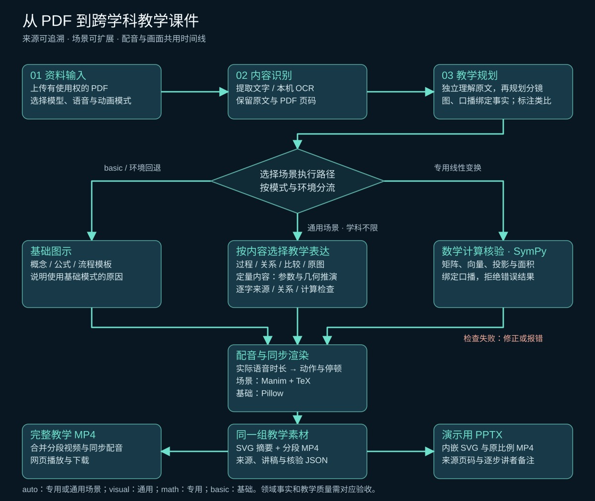

# 智讲 Agent（Book2Course）

**语言 / Language：** [简体中文](README.md) | [English](README.en.md)

智讲 Agent 将有使用权的 PDF 转换为中文教学视频和演示用 PPT 课件。文字版 PDF 直接提取内容，扫描页在本机 OCR。上传资料后，页面展示课程结构、逐段讲稿、PDF 页码与原文摘录，并提供可下载的 MP4 和 PPTX。PPTX 内含 SVG 教学图示、逐段可播放的讲解动画及讲者备注。

系统提供两种生成方式：**真实 AI 模式**调用本机 Ollama 或外部兼容模型；**确定性演示模式**无需模型或密钥，使用固定规则生成内容，并在页面与视频中标明。网页可为单次任务调整文本模型提供方、API 地址、模型名称、密钥和讲解提示词，也可单独设置语音 API 地址、模型、音色和密钥。配音可使用 Windows 中文系统语音、本机 Kokoro 中文 AI 语音模型或外部兼容语音服务。来源核验只确认摘录与对应提取/OCR 文字匹配，知识解释和 OCR 准确性仍需人工复核。

## 从书籍到课程的流程

草稿中的“书籍 → OCR／排版 → 页面”和“主画面 → 配音／动画 → 合成”在这里整理为同一条可溯源的制作链。流程图包含基础图示、跨学科通用场景和二维线性变换专用推演三条路径。场景经过对应检查，再按实际配音时长用 Manim 和 LaTeX 渲染。来源核验能检查引文位置，教学质量仍需人工核对。

[](docs/workflow.zh.svg)

基础视频由 Pillow 绘制。通用教学过程与专用数学视频由本机 Manim Cairo 渲染并用 LaTeX 排版公式。PPTX 自动生成封面及每个知识点的 SVG 摘要页、动画页：标题等文字可编辑，SVG 附 PNG 兼容图，分段 MP4 可在放映时点击播放；讲者备注包含逐步口播、原文页码与摘录。通用与专用教学片段含配音，与完整教学视频使用相同素材，并按 16:9 原比例嵌入。

### PPT 内容制作 skills

仓库内的以下 Codex skills 可用于改进 PPT 内容和素材；网页使用内置模板自动生成 PPTX，不会自动调用这些 skills。可以在本项目的 Codex 任务中按名称调用：

| Skill | 用途 |
| --- | --- |
| [`$book2course-ppt-outline`](.agents/skills/book2course-ppt-outline/SKILL.md) | 按知识依赖和来源页码规划逐页大纲，检查重要知识点是否遗漏。 |
| [`$book2course-ppt-script`](.agents/skills/book2course-ppt-script/SKILL.md) | 为每页写演讲稿、讲者备注、配音文案和画面播放提示。 |
| [`$book2course-svg-diagrams`](.agents/skills/book2course-svg-diagrams/SKILL.md) | 制作可编辑的 SVG 流程图、概念关系图和公式步骤图。 |
| [`$book2course-explainer-animation`](.agents/skills/book2course-explainer-animation/SKILL.md) | 设计连续变换式讲解动画，并核对画面、口播和时间线；可按需使用 [Manim Community](https://docs.manim.community/en/stable/)。 |

需要定制自动课件之外的讲解时，可用 Codex 的 Presentations skill 组装大纲、讲稿、SVG 与动画素材，并检查版式和备注。网页中的跨学科通用场景与二维线性变换专用执行器已经接入自动生成；Manim 通过可选依赖安装。

## 教学过程动画与跨学科扩展（可选）

在已有环境中安装：

```powershell
.\.venv\Scripts\python -m pip install -e ".[math-animation]"
latex --version
dvisvgm --version
```

需要 TeX Live 或其他提供 `latex`、`dvisvgm` 与 `standalone` 宏包的 LaTeX 环境，加入 PATH 后重启 Web 服务。此电脑使用已有 TeX Live，无需 GPU。教学动画在本机 CPU 渲染；文本模型与语音服务使用网页配置的 API。

网页选择真实 AI 模式，可调整“动画生成方式”：

| 模式 | 行为 |
| --- | --- |
| `auto`（新 AI 任务默认） | 二维线性变换使用专用推演，其他内容按来源选择通用图示或参数化场景；环境未就绪时使用基础图示并说明原因。 |
| `visual` | 强制使用通用教学场景，学科不限；分镜或声明的数值关系无法通过检查时明确报错。 |
| `math` | 要求可核对的二维线性变换资料和完整数学环境；不支持的内容、参数或计算核验失败会明确报错。 |
| `basic` | 使用原有概念、公式与流程模板；PPT 的基础动画仍为静音片段。 |

专用执行器支持线性条件与平移反例、基向量与矩阵列、网格及单位正方形变换、正交投影及特征方向、旋转与伸缩的复合顺序。可以在提示词中指定 `A=[[2,1],[0,1]]`、`v=[1,2]` 等教学参数；所有补充算例标注“教学示例”。数学任务聚焦这一主线，不会把教材中的三维或函数空间内容伪装成已支持场景。

通用场景 `visual_scene` 不按学科名称设白名单。模型可以使用曲线、点、圆、线、箭头、多边形和标签，定义稳定的对象身份、参数及逐步变化，生成微积分、概率、物理、化学、生物或其他领域的教学过程。相同数据生成 SVG 摘要、配音动画和 PPT 讲者备注。计算公式由受限表达式生成 LaTeX；表达式数值和对象位置随动画参数同步更新。

通用任务先分析当前知识点的教学表达，选择可计算几何、过程图、关系图、比较图或原文图示讲解。非定量内容由模型规划节点、关系、问题及逐步讲解，程序共享布局生成 SVG 图片和带配音的关系追踪动画。节点与关系分别核对原文摘录；复杂原图可直接使用本地提取的 PDF 页面，保留原始图片和矢量图。几何方案反复失败时重新选择表达方式，避免强迫每个知识点变成坐标移动。每段选择依据与核验范围保存在场景数据及 PPT 备注中。

教学设计先在不接触候选分镜或讲解风格的调用中独立理解原文，保留完整句子的主语、动作和条件；之后规划对象与关系，口播通过 `source_fact_id` 选择来源事实；程序将当前事实与对应的图形焦点、连线绑定，类比通过独立 `example` 字段选择同一事实，程序直接填入 `source_statement`，模型不能重新改写。定性图示按内容选择 1–5 步，不为凑步数扩写事实。原创生活类比 `analogy` 单独记录，实际配音明确标出类比。比较图和原页标注允许没有连线，不为连接所有对象编造因果；原页标注也可只围绕一个对象解释不同的来源事实。程序编号原文片段，用原始短语构建可选术语，检查关系两端及相邻上下文的依据；模型不能翻译来源术语或用无关摘录拼出因果。同一摘录可支持不同概念，重复标题仍会被拒绝。可确定的来源编号错误由程序修正并记录。参考文献不作为独立教学知识点。过程图使用有方向的信息流；关系和比较用关联线，避免视觉上暗示因果。定性关系追踪不能充当三维手部运动、物理或生物机制模拟；审稿逐项记录对象、关系和每步口播的原文含义及理由；拒绝将共现说成因果、添加保证或来源没有的必要条件。数值检查区分技术测量与普通不定指、明确标注的生活类比，仍不能代替含义核对。同一模型审稿通过也不能证明全部领域事实正确。

可选安装项包含 PyMuPDF（原页提取与真实文字区域定位）和 Jieba（中文原文词语候选提取）；词语不是固定的学科词表。Ollama 调用先读取模型实际支持的[推理设置](https://docs.ollama.com/capabilities/thinking)，不根据模型名称强制开关。可切换推理的模型在设计和审稿阶段启用推理；仅支持推理的模型遵循服务默认设置，非推理模型不发送该开关。输出预算耗尽会明确报错，调用时长和 token 数保存在本地诊断文件中。本机 CPU 推理可能需要更长时间，网页显示当前规划阶段。

定性图的中文对象名、原文术语和来源编号以同组契约从独立来源事实中选择；连线通过 `source_fact_id` 选择同一事实，程序提取两个端点之间的完整谓词，保留否定词和限定词。模型不能另写连线标签或交换主语、宾语。复杂从句和被动关系无法忠实压缩时，采用比较或原页标注。一个片段最多加入一个完整的生活类比（12–80 字符），其他步骤保留事实，避免每一步都强行类比；类比不得描述原文未证实的技术行为。程序拒绝保证式类比，并从当前来源自动提取实体名，防止类比重新加入技术对象行为。图示标题和表达说明依据已核对知识点及表达类型生成，模型原始问题与理由保存在诊断中，避免标题另添技术断言。

这次用户 PDF 的失败复现、运行条件和实际验收见[真实资料生成修复验证](docs/content-design-validation.md)。

九页 RealDex 论文已通过本机模型与语音服务生成 13 页 PPTX、6 张 SVG 和 3 分 34 秒的带配音视频，网页播放及下载已检查。本次六段均采用原页讲解；标签清晰度、扁平化数学符号和机制动画仍有未通过的教学质量项，具体记录在上述报告中。

请求生活例子时，比较图和原页讲解优先保留原文明确提供的示例，绑定同一来源事实，并避免另编类比。原文理解草稿必须是完整中文句子；旧缓存中的英文或截断输出会重新生成。SVG 的 PNG 兼容图保留原始画布尺寸，避免裁掉讲解字幕和来源。

逐项审查允许简洁的原文对象名称，另用核对理由说明依据，避免为满足句长而扩写事实。损坏的模型正文保存在本机任务目录的 `model-format-errors.json`，不进入网页错误信息；该文件不记录请求头、密钥或推理字段。

比较与原页讲解检查明确相邻的过程操作：原文写出初始操作及紧邻的“随后”操作时，图示保留这组来源事实并按原顺序讲解，避免跳过中间步骤。检查依据是原文操作顺序，不是固定学科或流程模板。

原页与比较讲解还将知识点标题中最具体的原文词语绑定到来源事实，要求口播覆盖该事实；同页的其他事实不能取代当前主题。该局部文字检查不能代替同义词、整章覆盖或教学质量的核对。

跨学科回归素材包括割线逼近、概率面积、抛体运动、原子重排和酶催化示意，使用同一执行器生成带配音 PPTX 与视频。这些开发者编写的分镜用于核验表达、计算与渲染；真实 PDF 的模型自动规划另行验收。实际结果及专业简化条件见[通用场景验证报告](docs/general-scene-validation.md)。

真实 MIT 微积分 PDF 已通过网页、本机模型和语音 API 生成课件与动画。本次使用了明确的教学指引，并人工修正三处割线颜色与口播不一致的问题；它验证了这条制作链，不能作为本机小模型无引导处理任意教材的质量证明。报告分别记录原始输出、修正和验收范围。

内置检查覆盖表达式、几何状态、插值过程、数值相等、非负与上界等声明关系。通过项目代码或 `book2course.visual_checks` / `book2course.visual_validators` Python 安装入口可增加领域核验；后者能读取完整场景及 `domain_data`，用于量纲、原子或知识关系检查。模型不能执行代码或自行注册规则。复杂机制和新图形原语可以扩展执行器，详见[通用场景架构](docs/scene-graph.md)。学科范围开放不等于任意资料都能得到相同教学质量，需要对应资料与验收。

模型选择参数、问题并生成结构化分镜，程序只执行受支持的操作，不执行模型代码。SymPy 核验矩阵乘法、向量终点、面积、投影幂等性、特征关系和复合顺序；错误计算被拒绝。数学口播采用绑定计算状态的参数化说明，保留模型草稿供核查，避免口播与正确的计算声明相矛盾。逐句合成配音，依据真实时长保持中间状态；旋转用角度插值保持长度，投影沿法线收缩。SVG 摘要使用同一组核验数据。

`GET /api/config` 返回 `math_animation` 和 `visual_animation` 环境状态；上传字段 `animation_mode=auto|visual|math|basic` 选择模式。完成后网页显示场景与核验范围，并通过 `GET /api/jobs/{id}/scenes` 下载参数、分镜、口播、音频时间线、计算与渲染几何检查的 JSON。专用任务保留 `/math-scenes` 接口。`math_scene` 与 `visual_scene` 均为可选字段，旧课程数据仍可读取。

验证资料为 MIT 五页讲义 [Linear transformations and their matrices](https://ocw.mit.edu/courses/18-06sc-linear-algebra-fall-2011/resources/mit18_06scf11_ses3-6sum/)。原理引文保留 PDF 页码；矩阵算例、面积与中文动画讲解为补充内容。验证方法和实际结果见[数学动画验证报告](docs/math-animation-validation.md)。MIT 资料按其 [CC BY-NC-SA 4.0 许可](https://ocw.mit.edu/pages/privacy-and-terms-of-use/)注明来源；本地测试文件保存在忽略提交的 `data/`。

## 快速开始（Windows）

在项目目录运行：

```powershell
python -m venv .venv
.\.venv\Scripts\python -m pip install -e ".[test]"
.\.venv\Scripts\python -m uvicorn zhijiang.main:app --host 127.0.0.1 --port 8765
```

打开 [http://127.0.0.1:8765/](http://127.0.0.1:8765/)，上传有使用权的 PDF，确认资料使用权后开始生成。可用[示例讲义](examples/binary_search_original.pdf)体验。生成完成后可查看来源、播放或下载视频、下载 PPTX，也可删除本地任务和资料。旧任务若没有 PPTX，重新上传原 PDF 即可生成。失败任务可用原 PDF 重新生成。按 `Ctrl+C` 关闭 Web 服务。

运行环境为 Python 3.11+；选择系统配音时需要 Windows 中文系统语音。已在 Python 3.13 上验证。`rapidocr` 和 `onnxruntime` 在本机执行 OCR，`pypdfium2` 负责扫描页渲染。`python-pptx` 生成课件，`imageio-ffmpeg` 提供视频与内嵌动画合成所需的 FFmpeg，无需单独安装系统 FFmpeg。

## 使用本机 Ollama

安装并启动 [Ollama](https://ollama.com/)，通过 `ollama list` 检查模型。默认模板使用非推理版 [`qwen3:4b-instruct`](https://ollama.com/library/qwen3%3A4b-instruct)；如果本机没有该模型，可运行 `ollama pull qwen3:4b-instruct`。安装其他模型时，在网页填写实际模型名。复制配置模板后重启 Web 服务：

```powershell
Copy-Item .env.local.example .env.local
```

`.env.local` 已加入 `.gitignore`。可在其中修改 Ollama 地址和模型名。真实 AI 模式通过本机 `/api/chat` 生成知识点、课程规划和讲稿；PDF 提取文本不会发送到外部文本模型。模型先选择带页码的原文片段编号，程序再填入并核验引文，减少模型改写原文造成的错误。结构化调用使用 8192 上下文；通用分镜分为对象布局与操作计算两次调用，分别检查并修正。CPU 推理和复杂分镜可能耗时较长。小模型可能多次修正或无法通过检查，可在网页切换更强的模型 API。

本机验证使用 Ollama 0.35.1。低内存电脑可在启动 Ollama 前设置其 llama.cpp 后端的[提示缓存上限](https://github.com/ggml-org/llama.cpp/blob/master/tools/server/README.md)；此机已设置为 512 MiB。先退出已有 Ollama 服务，再在终端启动：

```powershell
$env:LLAMA_ARG_CACHE_RAM = "512"
ollama serve
```

该设置取决于所用后端版本，重启服务后生效。模型接口的 5xx 错误最多进行一次格式重试；聊天解析器返回 HTTP 500 时，使用相同契约调用 Ollama 原生[生成接口](https://docs.ollama.com/api/generate)。只移除完整、有效 JSON 对象后重复的结束符，后续来源与含义核对仍须通过。持续失败会保留进度并报告错误。

失败任务可调整页面中的生成方式、文本/语音 API、音色、提示词和动画模式，再点击“使用原 PDF 重新生成”；重试采用当前设置，无需再次上传。更换外部服务地址需重新确认发送许可并提供对应密钥，旧地址的任务密钥不会传给新地址。

可通过 `/?job=任务编号` 在本机重新打开任务进度与产物，任务编号为接口返回的 32 位标识。

失败重试保留已完成的 PDF 解析、知识点提取和通过逐项审稿的分镜。来源匹配后的结构草稿保存在 `source-structure-XX.json`，口播失败可续做；这类草稿仍未获批准，复用后必须完成逐项含义审稿。独立原文理解草稿保存在 `source-reading-XX.json`，复用草稿后仍须逐项审稿，不把缓存当作批准。复用分镜时重新核查来源与执行规则，随后重新配音和渲染；未通过的候选不进入缓存。更换 PDF、模型地址、模型或提示词时自动使相关分析缓存失效；缓存不含 API 密钥。知识点编号受当前原文批次的输出契约约束；提取保留定义和条件的上下文，排除多列计数表头。候选方案和拒绝原因保存在任务目录的 `knowledge-planning.json`、`teaching-design-XX.json`；`model-calls.json` 记录本机调用耗时、token 数和输出终止原因，便于定位失败阶段。

基础模式讲稿中的具体数字须出现在对应原文摘录中；否则要求重写，仍不符合时删去相关句子或要点并提示复核。专用推演和通用场景允许标明条件的原创教学参数及计算结果，不受这个原文数字过滤器误删；原理引文和补充算例分别标注。数值关系检查不证明自由口播、领域事实或教学解释完全正确。

可计算几何分镜的自由口播描述对象、操作和原因，具体数值由已核验参数与计算结果生成。程序拒绝未绑定的字面数字及常见中文数值断言，避免审稿模型放过错误计算口播。每个新片段规划 3–5 步，每步定性口播 12–100 字符，以短步骤组织连续讲解；旧课程数据仍可读取。原始模型草稿仍保留；定性解释与领域事实继续需要来源和人工核查。

也可以不创建 `.env.local`，直接在网页选择真实 AI 模式并填写本次任务的 API 配置。API 密钥仅在任务运行期间留在服务进程内存，不写入 SQLite、课程 JSON 或网页响应；刷新页面或服务重启后重试外部模型任务，需要重新输入密钥。自定义提示词作用于课程规划、教学参数和基础讲稿风格；首轮数学口播由核验模板生成，提示词不能绕过来源与计算核验。

已生成的[示例视频](demo/zhijiang_ollama_demo.mp4)与[讲稿及来源](demo/zhijiang_ollama_lesson.json)可直接查看。示例视频的讲稿由本机模型生成，声音来自 Windows 系统语音。

## 整本扫描教材的进度与续跑

扫描页逐页显示解析/OCR 进度并保存 `parsed-pages/page-XXXXX.json`，包括已处理的空白页。知识点按原文批次显示进度，核验通过后立即保存 `knowledge-batches/batch-XXXX.json`。失败后使用原 PDF 重试可复用已完成页面和批次；更改原 PDF 或对应分析设置会使相关缓存失效。以前完成的整份解析缓存也可复用，无需重新 OCR。

本机 Ollama 使用流式响应显示当前调用耗时与已收到字符数；读取材料、尚未返回正文时也更新耗时。完整响应和完成标记都收到后才核验、保存结果，不把部分 JSON 当成成功。CPU 上处理整本教材仍可能耗时较长；网页百分比表示阶段进度，不是预计剩余时间。可以关闭或刷新网页，通过任务链接继续查看，但本机服务须保持运行。

中文扫描摘录保留短定义、换行与相邻语境，排除明确版权/编者说明/目录页；判断题保留题目说明。知识摘要拒绝补入当前引文没有的数值，不能猜测 OCR 缺失的分数与比例。原创教学算例在后续场景中另行标记与核验。文字匹配及数字检查仍不能证明 OCR、题目解答或全章覆盖正确。

实际六年级扫描教材的诊断、测试与续跑状态见[长教材进度验证](docs/long-textbook-progress.md)。

一个知识点未通过数值检查时，只修正该条目的解释，保持已通过条目的标题、类型、解释和来源不变，也不删掉出错主题来凑成功。未批准的批次草稿保存为 `batch-XXXX.draft.json`，重试继续修正后再核验；它不是已完成的知识点缓存。持续失败时报告具体知识点，保留草稿与修正记录，便于核对原文。

自由改写持续失败时，模型只能为该知识点选择当前摘录中可读的说明句编号，程序逐字填入原句；候选句不含具体数值或分数，且必须属于该知识点的来源。短摘录缺少可用说明时，再从同一原页选择有依据的原文片段编号，更新该出错条目的引文并重新生成定性说明；同页引用须通过连续文字匹配，旧缓存也重新检查。没有可用候选或选择不匹配时明确报错。这种受限修复保留主题，不猜补损坏的 OCR，也不等于已恢复缺失公式。

数字相同不代表分数、比例和公式正确。知识摘要中的定量分句必须逐字保留当前摘录；否则定向修正为可读的定性概念，并提示核对原图。检查包含中文分数和常见数值断言，区分“一个数”“两个数”等泛指表达，以及原文已有的 `CO2`、`H2O`、`B12` 等名称。旧批次仍按当前规则复核；通过条目不重写。这些文字规则不能证明任意领域事实或完整教学含义。

本机 Ollama 的原生 Schema 解码中断时，任务尝试普通 JSON 解码，并继续按完整数据契约验证；该格式恢复最多三次调用，格式合格不等于内容通过。成功的兼容方式在当前任务的同类阶段复用，记录于 `model-calls.json`。来源事实的解码正则有长度上限，程序可只补齐缺失的句末标点；短片段、截断运算符、错误编号和非中文说明仍被拒绝。

扫描页进入分镜前，独立来源事实也复核数值引用。无法逐字绑定的数值推断不进入事实数组，拒绝记录保存在 `source-reading-XX.json` 的 `rejected_facts`；课程知识点仍保留，已有可读定义和条件继续用于讲解。没有可核验事实时明确报错。此检查不恢复 OCR 缺失数值，也不取代逐项语义审稿与原图核对。

定性图示默认讲解来源事实，只有提示词明确请求生活例子或类比时才开放新增类比；原文已有示例时优先保留。数值示例须进入计算核验的场景，不能借生活类比补写未经核验的分数或测量值。

扫描页中尚未作答的数量问题保留在原页供核对，不作为已成立的事实口播；即使数字出现在 OCR 中，分数版式也可能丢失。重试时重新检查事实草稿，剔除被拒绝的可选断言并记录原因，其余可读事实继续复用。

模型的 OCR 事实草稿全部被数值检查拒绝时，可从当前片段选择可读的原文说明句编号，程序逐字填入，修复记录见 `source-reading-XX.json/repairs`；没有可用句子仍报错，原文含义审查继续执行。对象候选支持数量短语和动作短语，不要求所有知识都能被词性标注为名词。连线保留原文的完整谓词，包括“乘”“是”等单字谓词；并列词不构成关系。显示名称在同一引文中明确出现时，程序将 `source_term` 绑定到该原文名称，并记录 `literal_node_name`，避免误选附近数字；翻译和语义仍须审查。

来源事实先检查完整 JSON 容器、条数和来源编号，再逐条检查完整中文句子、长度与数值依据；坏条目单独拒绝并记录，其余可用事实保留。容器格式修复仍失败时，扫描页也可尝试上述原句选择；不接受损坏 JSON 的局部正文，也不把连接或超时错误当成内容修复。

含义审查按表达方式核对节点：原页标注和比较图可标注短语、动作、条件或结果，不要求每项都是独立实体；不为没有连线的标注推断关系。关系和过程图的连线仍须分别核对原文依据，错误指代和口播中遗漏的条件会被拒绝。

审稿输出先记录每项的原文含义与理由，再给出支持判断及整体结论；当前问题来自分镜，不能误用同页另一道练习替代。完整课程顺序保存到 `course-order.json`，分镜失败后重试可复用；来源、知识点、提示词、模型或 API 地址变化会使该缓存失效，遗漏或重复编号不能复用。

## 使用本机 AI 配音

本机无 NVIDIA 显卡时，可通过 CPU 运行支持中文的 [Kokoro-82M v1.1-zh](https://huggingface.co/hexgrad/Kokoro-82M-v1.1-zh)。在项目目录安装可选依赖并下载 [ONNX Community 的量化模型](https://modelscope.cn/models/onnx-community/Kokoro-82M-v1.1-zh-ONNX)及 4 种中文音色（约 130 MB，保存在忽略提交的 `data/models/kokoro/`，下载脚本会校验 SHA-256）：

```powershell
.\.venv\Scripts\python -m pip install -e ".[local-tts]"
.\.venv\Scripts\python scripts\download_local_tts.py
```

在一个终端启动本机语音 API，并保持运行：

```powershell
.\.venv\Scripts\python -m uvicorn zhijiang.local_tts:app --host 127.0.0.1 --port 8766
```

在另一个终端启动主 Web 服务。复制 `.env.local.example` 为 `.env.local` 后，网页会默认填入 `http://127.0.0.1:8766/v1`、模型 `kokoro-82m-v1.1-zh` 和中文音色 `zf_001`。还可选择 `zf_002`、`zm_009`、`zm_010`。也可不创建配置文件，直接在网页选择“AI 语音配音”并填写这些值。本机接口无需 API 密钥，语音合成在本机进行；首次请求需加载模型，长讲稿在 CPU 上需要更多时间。可打开 [语音服务健康检查](http://127.0.0.1:8766/health)确认模型文件已安装。

## 外部模型与语音服务

如需使用外部文本模型，在启动服务前设置兼容 `POST /chat/completions` 的服务地址、模型名和密钥：

```powershell
$env:ZHIJIANG_LLM_PROVIDER = "openai"
$env:ZHIJIANG_LLM_BASE_URL = "https://你的服务地址/v1"
$env:ZHIJIANG_LLM_API_KEY = "你的密钥"
$env:ZHIJIANG_LLM_MODEL = "你的模型名"
```

外部 AI 配音需要兼容 `POST /audio/speech` 并能返回 WAV。以下变量可替换 `.env.local` 中的本机语音配置；也可在网页为单次任务填写：

```powershell
$env:ZHIJIANG_TTS_BASE_URL = "https://你的语音服务地址/v1"
$env:ZHIJIANG_TTS_API_KEY = "你的语音密钥"
$env:ZHIJIANG_TTS_MODEL = "你的语音模型名"
$env:ZHIJIANG_TTS_VOICE = "alloy"
```

使用外部服务时，网页会要求额外确认发送提取文本或讲稿。语音和文本 API 密钥仅在任务运行期间保留在服务进程内存；失败后重试外部语音任务需要重新输入语音密钥。不要将密钥提交到仓库。

## 测试与示例

```powershell
.\.venv\Scripts\python -m pytest
.\.venv\Scripts\python scripts\generate_sample_pdf.py
.\.venv\Scripts\python scripts\build_demo.py
.\.venv\Scripts\python scripts\build_ollama_demo.py
.\.venv\Scripts\python scripts\build_general_examples.py
.\.venv\Scripts\python scripts\verify_teaching_artifacts.py --job-dir data\jobs\你的任务ID
```

`build_ollama_demo.py` 需要先配置本机 Ollama。项目还提供[无需模型的示例视频](demo/zhijiang_demo.mp4)。

`build_general_examples.py` 使用同一通用执行器渲染五组原创微积分、概率、物理、化学与生物示意，并调用已配置语音 API。它验证开发者分镜与执行器；真实模型自动规划另通过网页上传资料验证。详见[跨学科验证记录](docs/general-scene-validation.md)。

## 当前支持范围

- 单机顺序处理任务；一份 PDF 生成一节课。
- 支持文字版和扫描版 PDF；上传大小上限 200 MB，没有固定页数上限。扫描页在后台逐页 OCR，处理时间会随页数增加。
- AI 模式从全部有文字的页面分批选取依据并生成课程，不限制目标视频时长；实际时长取决于资料、模型输出和配音速度。长文档会产生更多模型调用。
- 演示模式也不限制页数或片段数；两页以内的示例仍选前 6 个片段，较长资料从每页选取最多 3 个片段。
- PPTX 为每个片段生成 SVG 图示页和内嵌 MP4 动画页。通用与专用教学动画包含同步配音，基础动画为静音；放映时点击播放。课件大小和时间随内容增加。标题、来源标签可编辑，SVG 内部路径不是独立的 PowerPoint 形状。
- 通用场景支持各学科的二维参数化过程，专用推演覆盖上述五类线性变换。复杂三维、真实分子动力学等需要新增执行器；跨章节推理和知识事实自动证明尚未实现。
