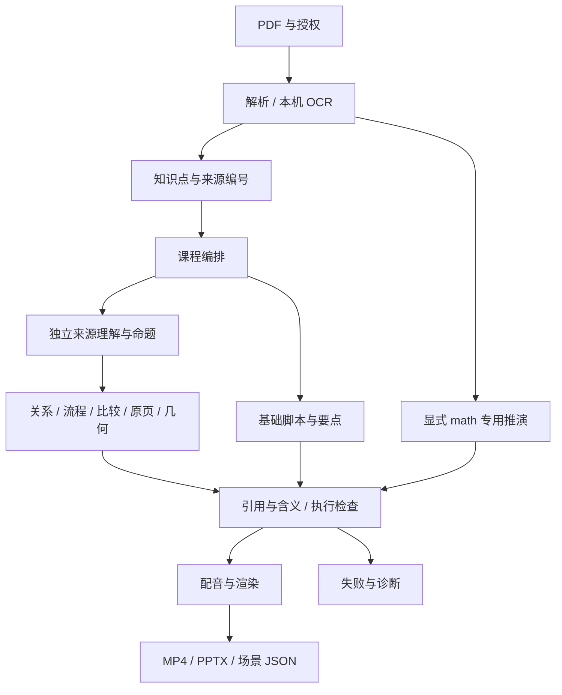
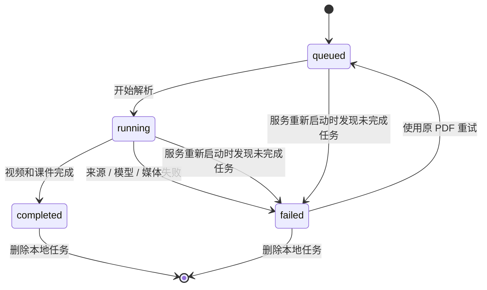

# 架构与接口

适用：应用 0.1.0，文档整理于 2026-10-08。字段以 [models.py](../zhijiang/models.py)、接口以 [main.py](../zhijiang/main.py) 为准；服务启动后可查看 `/docs` 和 `/openapi.json`。

## 1. 分层与代码职责

| 层 / 业务阶段 | 文件 | 交接与边界 |
| --- | --- | --- |
| 网页 / API | `static/`、`main.py` | 文件与表单校验、授权/外部同意、任务与产物接口；不是多项目管理系统。 |
| 配置 / 状态 | `config.py`、`storage.py` | 环境变量优先于 `.env.local`；SQLite 存任务与课程，密钥只在内存。 |
| 编排 | `pipeline.py` | 单线程执行队列、阶段进度、缓存与失败处理。 |
| 读取资料 | `pdf.py` | 位置文字提取、本机 OCR、分页缓存；没有完整章节/表格/公式块模型。 |
| 知识 / 课程 / 脚本 | `agents.py` | Demo 与 AI 实现、原文编号选择、课程规划、基础讲稿和检查。 |
| 来源 / 知识关系 | `teaching_design.py`、`teaching_graph.py` | 独立来源事实与命题、受约束图示、逐项含义审查。 |
| 通用场景 | `visual_planning.py` | 图示或几何表达、受限运算和扩展验证器；不执行模型代码。 |
| 布局 / 渲染 | `teaching_layout.py`、`teaching_renderer.py`、`visual_renderer.py` | SVG 与动画共享关系布局；Manim 执行受支持画面。 |
| 专用数学 | `math_planning.py`、`math_renderer.py`、`math_media.py` | 显式二维线性变换场景、SymPy 核验与计算绑定口播。 |
| 配音 / 媒体 | `speech.py`、`local_tts.py`、`visual_media.py`、`video.py` | 系统/兼容语音、本机 Kokoro、时序、逐段与整课视频。 |
| 课件 | `presentation.py` | SVG/PNG、内嵌 MP4、标题、来源与讲者备注。 |
| 验收 / 工具 | `tests/`、`scripts/` | 模拟服务、契约回归、真实媒体核对与文档导出。 |

这里的多 Agent 是业务阶段隔离的模型调用与程序模块，共用配置的模型客户端，没有独立常驻 Agent 集群。

## 2. 当前处理链

`auto` 为 AI 任务按知识点使用通用场景；动画环境不支持时走基础图示。`visual` 强制通用场景；`math` 显式专用推演；`demo` 固定使用基础路径。失败不会通过改成“知识正确”来放行。

## 3. 真实数据契约

| 对象 | 已有核心字段 |
| --- | --- |
| `PageText` | `page`、`text`、`ocr`；物理页码从 1 起。 |
| `SourceDocument` | `filename`、`pages`；页面列表不包含没有可用文字的页。 |
| `Evidence` | `page`、`quote`、`ocr`；摘录由真实来源选择回填。 |
| `KnowledgePoint` | `title`、`kind`、`explanation`、`evidence`。 |
| `CourseOutline` | `title`、`objective`、`point_titles`。 |
| `LessonSegment` | `title`、`kind`、`narration`、`bullets`、`evidence`、可选 `math_scene` / `visual_scene`。 |
| `Lesson` | `title`、`objective`、`segments`、`mode`、`voice_mode`、`notice`、`animation_report`。 |
| `GenerationOptions` | `provider`、`base_url`、`model`、`prompt`、`animation_mode`、`semantic_thinking`；`api_key` 排除序列化。 |
| `SpeechOptions` | `base_url`、`model`、`voice`；`api_key` 排除序列化。 |

`kind=concept|formula|process` 是知识点基础类型，不是完整块分类。关系、比较、原页等表达类型在 `visual_scene.diagram.representation` 中。

### 来源知识图

`TeachingDiagram` 包含 `representation`、`rationale`、`nodes`、`relations`、`steps`、`source_facts`、可选源页图片及区域。节点带 `source_quote`、`source_term` 与实体/操作/条件角色；关系保留来源命题/事实编号、谓词、方向、支持摘录和条件；步骤以 `source_fact_id` 绑定口播和图形焦点。

独立命题读取先于图形候选，程序依据命题构建端点与关系。共现、标题或页面邻近不能单独建立因果。场景中的编号是局部编号，当前没有跨教材实体归一、全书图谱存储或先修依赖推理。

新设计的原页标注以完整来源摘录定位；原文出现的名称才精确定位到该名称。区域坐标用于图示，不是参考文档推荐的通用 `content_id/block_type/confidence` 内容块 API。模型事实与审稿仍可能有假阳性，人工复核不可由图谱替代。

## 4. 任务状态与产物可用性

`status` 仅有 `queued|running|completed|failed`。`stage` 为当前显示文字，失败时一般变为 `failed`，启动中断恢复使用 `interrupted`；没有稳定的阶段错误码、阶段时间表、取消状态或人工 `REVIEW_REQUIRED`。任务记录有 `created_at/updated_at`，不是每个阶段的开始/结束时间。

`has_lesson` 可以在媒体完成前为真；`has_video/has_presentation` 是文件存在标志。下载接口还检查任务 `completed`。不能仅看文件或课程存在就宣称任务成功。

## 5. API

| 方法 / 路径 | 成功响应 | 关键边界 |
| --- | --- | --- |
| `GET /api/config` | 200 配置/环境 JSON | 不返回密钥；ready 表示配置/依赖就绪，不证明远端可用。 |
| `POST /api/jobs` | 202 任务 JSON | 缺权利/外部同意 400；上传超限 413；参数契约不符 422。 |
| `GET /api/jobs/{id}` | 200 任务 JSON | 无记录 404。 |
| `GET /api/jobs/{id}/lesson` | 200 `Lesson` | 未生成 409；无任务 404。 |
| `GET /api/jobs/{id}/video` | 200 MP4 | 未完成或缺文件 409。 |
| `GET /api/jobs/{id}/presentation` | 200 PPTX | 未完成或缺文件 409。 |
| `GET /api/jobs/{id}/scenes` | 200 场景 JSON | 通用或专用场景；基础模式可能无文件，返回 409。 |
| `GET /api/jobs/{id}/math-scenes` | 200 数学 JSON | 保留的专用兼容入口；缺数据 409。 |
| `POST /api/jobs/{id}/retry` | 202 任务 JSON | 仅失败任务；其他状态或原 PDF 缺失 409。 |
| `DELETE /api/jobs/{id}` | 204 无正文 | 排队/运行中拒绝 409；不存在 404。 |

### 创建任务表单

`multipart/form-data`，必填 `file` 和 `rights_confirmed=true`。可选：

- `mode=demo|ai`，默认 demo；`voice_mode=system|ai`，默认 system。
- `animation_mode=auto|visual|math|basic`；演示仅使用基础路径。
- `llm_provider=ollama|openai`、`llm_base_url`、`llm_model`、`llm_api_key`。
- `custom_prompt`，最长 4000 字符。
- `tts_base_url`、`tts_model`、`tts_voice`、`tts_api_key`。
- `remote_consent`，非回环地址的文本或语音服务要求 true。

同意判断依据地址，不是模型权重来源的自动审定；本机 Ollama 的云端模型别名也可能向外部发送。当前不提供公开网络部署的用户鉴权与权限系统。

### 状态响应

含 `id`、`filename`、模式、授权标志、`status`、`stage`、`progress`、`error`、创建/更新时间、产物标志及无密钥的 `model_settings/voice_settings`。没有 `project_id/document_id/review_status/retry_count` 等推荐字段。

重试表单可覆盖当前模型、配音、动画与提示词；`replace_settings` 控制提示词是否清空。新外部地址必须重新提交许可，不把旧地址的任务密钥转发到新地址。课程 JSON 读取不是课程修改 API；当前没有任务列表、PATCH 课程或审核接口。

## 6. 缓存与失败恢复

默认根目录 `data/`，可用 `ZHIJIANG_DATA_DIR` 修改。任务目录为 `data/jobs/{id}/`：

| 文件 / 目录 | 用途与复用范围 |
| --- | --- |
| `source.pdf` | 上传原文件，失败重试的输入。 |
| `parsed-source.json`、`parsed-pages/` | 来源哈希/解析版本绑定的整份与逐页解析，含空白页的缓存记录。 |
| `knowledge.json`、`knowledge-batches/` | 输入和设置指纹匹配的知识结果；批次草稿不算完成。 |
| `course-order.json` | 来源/知识/模型/提示词匹配且编号完整的课程顺序。 |
| `source-pages/` | 原页图片及哈希，损坏或输入变化重新导出。 |
| `source-reading-XX.json`、`source-propositions-XX.json` | 来源理解与命题；复用不等于审稿通过。 |
| `source-structure-XX.json`、`teaching-design-XX.json`、`planned-scene-XX.json` | 候选、修正和可复核场景；批准绑定设计摘要。 |
| `visual/scene-XX/`、`math/scene-XX/` | 图示、音频、动画和阶段媒体检查。 |
| `scene-data.json`、`math-scenes.json` | 场景与时间线数据，视表达路径生成。 |
| `lesson.mp4`、`lesson.pptx` | 完整交付；课程 JSON 主要存于 SQLite，不保证任务目录有 `lesson.json`。 |
| `knowledge-planning.json`、`model-calls.json`、`model-format-errors.json` | 本机诊断；格式错误可含资料正文，不上传、不在网页回显。 |

`POST retry` 清除结果媒体和 `visual/math` 素材，重新进入队列；符合当前规则的分析草稿/场景规划仍可复用。语音及渲染不是通用的“只重试失败步骤”保证。解析版本、源哈希、模型地址/名称、提示词等决定相应缓存失效，关系、条件和口播变更不能沿用旧审稿批准。

## 7. 测试与扩展入口

API 和状态测试在 `test_api.py`；PDF/模型在 `test_pdf_and_agents.py`、`test_ollama.py`；长文档/缓存在 `test_long_document_progress.py`；图示和来源在 `test_teaching_design.py`、`test_knowledge_graph.py`；媒体/计算在其他对应文件。模拟 HTTP 不等于验证线上供应商。

通用场景支持 `book2course.visual_checks` 和 `book2course.visual_validators` Python 安装入口，见[场景契约](scene-graph.md)。新增真实机制要增加执行器与对应核验，不以学科词表或测试教材名称决定画面。人工编辑、覆盖映射、审核和版本化需先设计新的数据契约，见[路线图](实现状态与路线图.md)。
