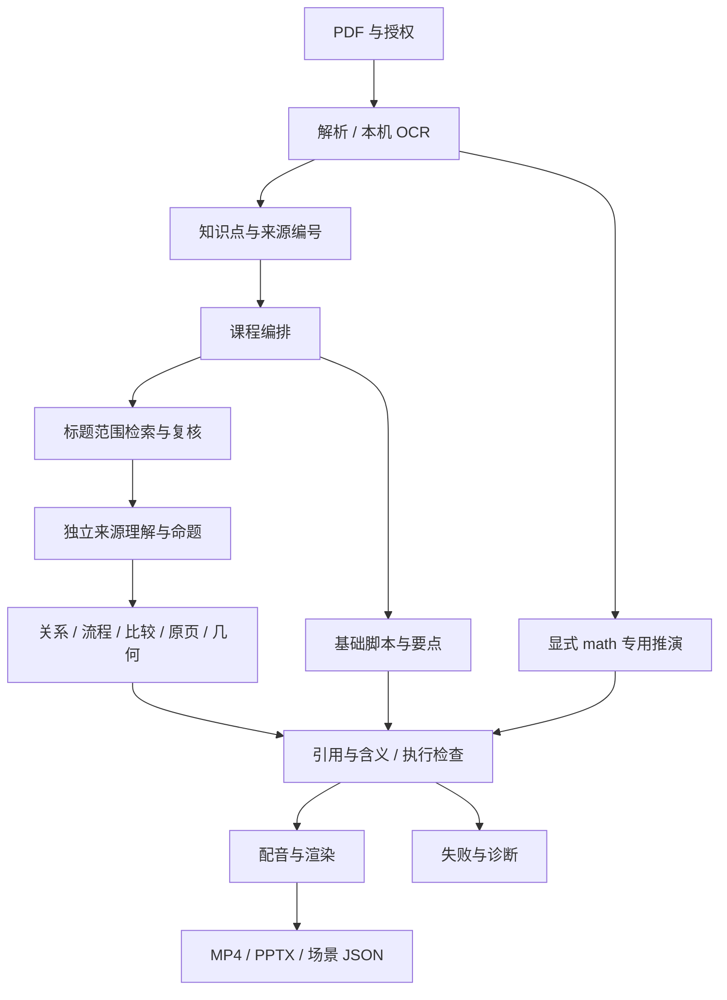
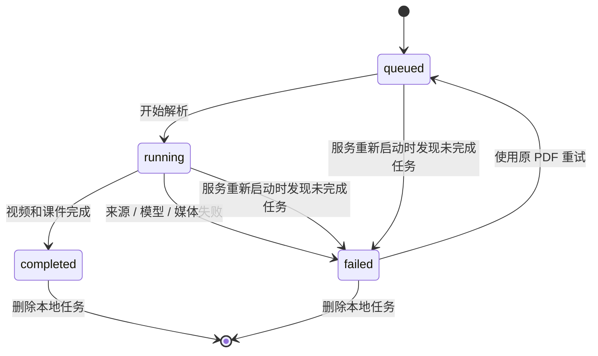

# 架构与接口

适用：应用 0.1.0，文档整理于 2026-10-08。字段以 [models.py](../zhijiang/models.py)、接口以 [main.py](../zhijiang/main.py) 为准；服务启动后可查看 `/docs` 和 `/openapi.json`。

## 1. 分层与代码职责

| 层 / 业务阶段 | 文件 | 交接与边界 |
| --- | --- | --- |
| 网页 / API | `static/`、`main.py` | 文件与表单校验、授权/外部同意、任务与产物接口；不是多项目管理系统。 |
| 配置 / 状态 | `config.py`、`storage.py` | 环境变量优先于 `.env.local`；SQLite 存任务与课程，密钥只在内存。 |
| 编排 | `pipeline.py` | 单线程执行队列、阶段进度、缓存与失败处理。 |
| 读取资料 | `pdf.py` | 位置文字提取、本机 OCR、分页缓存；没有完整章节/表格/公式块模型。 |
| 知识 / 课程 / 脚本 | `agents.py` | Demo 与 AI 实现、原文编号选择、课程规划、基础讲稿和检查。 |
| 来源 / 知识关系 | `teaching_scope.py`、`teaching_design.py`、`teaching_graph.py` | 标题范围检索/复核、独立事实与命题、受约束图示、逐项含义审查。 |
| 通用场景 | `visual_planning.py` | 图示或几何表达、受限运算和扩展验证器；不执行模型代码。 |
| 布局 / 渲染 | `teaching_layout.py`、`source_detail.py`、`teaching_renderer.py`、`visual_renderer.py` | SVG/动画共享关系与原页裁剪；Manim 执行受支持画面。 |
| 专用数学 | `math_planning.py`、`math_renderer.py`、`math_media.py` | 显式二维线性变换场景、SymPy 核验与计算绑定口播。 |
| 通用数学构造 | `math_sources.py`、`mathematical_planning.py`、`math_construction.py`、`math_behavior.py` | 原页公式识别、依赖构造图、按实际对象生成测量工具、操作与独立审稿。 |
| 配音 / 媒体 | `speech.py`、`local_tts.py`、`qwen_tts_service.py`、`speech_preview.py`、`visual_media.py`、`video.py` | 系统/兼容语音、本机 Kokoro 或隔离 Qwen、时序、逐段与整课视频。 |
| 课件 | `presentation.py` | SVG/PNG、内嵌 MP4、标题、来源与讲者备注。 |
| 验收 / 工具 | `tests/`、`scripts/` | 模拟服务、契约回归、真实媒体核对与文档导出。 |

这里的多 Agent 是业务阶段隔离的模型调用与程序模块，共用配置的模型客户端，没有独立常驻 Agent 集群。

## 2. 当前处理链

`auto` 为 AI 任务按知识点使用通用场景；动画环境不支持时走基础图示。`visual` 强制通用场景；`geometry` 强制通用数学对象且不回退到定性图示；`math` 显式专用推演；`demo` 固定使用基础路径。失败不会通过改成“知识正确”来放行。

## 3. 真实数据契约

| 对象 | 已有核心字段 |
| --- | --- |
| `PageText` | `page`、`text`、`ocr`、可选 `math_reading`；物理页码从 1 起。 |
| `SourceDocument` | `filename`、`pages`；页面列表不包含没有可用文字的页。 |
| `Evidence` | `page`、`quote`、`ocr`；摘录由真实来源选择回填。 |
| `KnowledgePoint` | `title`、`kind`、`explanation`、`evidence`。 |
| `CourseOutline` | `title`、`objective`、`point_titles`。 |
| `LessonSegment` | `title`、`kind`、`narration`、`bullets`、`evidence`、可选 `math_scene` / `visual_scene`。 |
| `Lesson` | `title`、`objective`、`segments`、`mode`、`voice_mode`、`notice`、`animation_report`。 |
| `GenerationOptions` | `provider`、`base_url`、`model`、`math_model`、`review_model`、`prompt`、`animation_mode`、`ppt_template`、`semantic_thinking`；`api_key` 排除序列化。 |
| `SpeechOptions` | `base_url`、`model`、`voice`；`api_key` 排除序列化。 |

`kind=concept|formula|process` 是知识点基础类型，不是完整块分类。关系、比较、原页等表达类型在 `visual_scene.diagram.representation` 中。

### 来源知识图

`TeachingDiagram` 包含 `representation`、`rationale`、`nodes`、`relations`、`steps`、`source_facts`、可选源页图片及区域。节点带 `source_quote`、`source_term` 与实体/操作/条件角色；关系保留来源命题/事实编号、谓词、方向、支持摘录和条件；步骤以 `source_fact_id` 绑定口播和图形焦点。

独立命题读取先于图形候选，程序依据命题构建端点与关系。共现、标题或页面邻近不能单独建立因果。场景中的编号是局部编号，当前没有跨教材实体归一、全书图谱存储或先修依赖推理。

新设计的原页标注以完整来源摘录定位；原文出现的名称才精确定位到该名称。区域坐标用于图示，不是参考文档推荐的通用 `content_id/block_type/confidence` 内容块 API。模型事实与审稿仍可能有假阳性，人工复核不可由图谱替代。

### 数学构造图

`geometry` 路径使用 `math_sources.py` 对照实际教材页图像转录与复核公式，再由 `mathematical_planning.py` 分开生成教学设计和受限构造数据。来源编号绑定原页摘录；`math_construction.py` 将依赖图编译为共同的 `VisualScenePlan`。没有按文件名、教材标题或八组验收主题分派分镜。

构造图中的边记录点、线、曲线等对象的依赖；来源关系连接到对实际对象的测量。中点、垂足、正方形、刚体变换、等面积分割、隐式距离关系、逆函数与有限展开由可信程序计算。符号计算只解析受限 AST，不执行模型 Python、SVG 或任意 SymPy 字符串。导数与有限展开使用 [SymPy 微积分接口](https://docs.sympy.org/latest/tutorials/intro-tutorial/calculus.html)，逆函数和隐式轨迹使用[方程求解接口](https://docs.sympy.org/latest/modules/solvers/solvers.html)。

数学模型与来源审稿记录保存在 `visual-planning.json`、`math-design.json` 与场景 `mathematical_model` 中。派生参数不能作为独立控制量覆盖；规划采样和视频逐帧重算依赖坐标，测量实际距离、角度、面积、函数值与导数。拒绝只对参数常数做恒等式校验。语义审稿与数值检查分别记录，不能据此宣称所有数学知识正确。

关系声明 `phase=invariant` 表示指定步骤的过程恒等式（`steps` 留空为全部步骤），`phase=endpoint` 只表示指定步骤完成后的结论，必须提供存在的步骤编号。执行器明确检查这些终点，不会把中间构造状态当作最终对象。无限直线与射线只绘制窗口示意，不能测量其“有限长度”；角度默认弧度，示例须注明单位与简化条件。

数学构造草稿最多 32 项；分割展开后最多 48 个核心对象，加入程序锚定点名后最终渲染契约最多 64 项。辅助端点、对齐对象和测量图元计入相应上限，不因扩充构造数量取消渲染边界。最终结构在开始配音前重新序列化校验，避免批准结果交接到渲染器后才因数量契约失效。点名随实际坐标移动，固定方向的布局按运动采样避让，实际成片仍须人工检查。

本机数学调用采用 16,384 token 上下文；构造阶段允许推理，并提高输出预算。运行时记录真实上下文、终止原因和输入/输出 token 数，以区分格式、表达能力与上下文截断。当前原页识别需要图像输入模型；配置外部模型时，授权范围包含教材页图像。

数学格式恢复最多三次；第三次首次达到输出上限时才允许额外一次扩大预算（上限 16K 输出）。截断正文永不进入批准。有限恢复仍失败后保留失败记录并停止，不能用重复规划掩盖接口、额度或预算问题。构造错误可在有效依赖图上应用受限补丁；口播、标签或行为错误保留正确对象图修复，连续两次操作失败返回构造层。

`llm_math_model` 在数学对象模式作为可选规划模型，负责设计、构造和操作；`llm_review_model` 作为可选独立来源与文字复核模型；图像生成模型读取原页并审查每步 SVG。空字段使用生成模型。独立复核应选与规划不同的模型，候选自查不算独立复核。`mathematical_model.model_roles` 保存实际职责，调用记录分别包含相应阶段，复核不构成正确性保证。来源主语通过对象类型、顶点数、可见步骤和测量依赖作结构绑定。

实际测量区分带符号坐标、非负距离/长度、非负小夹角与有向小角；比例使用实际对象的分母。刚体变换保持线段/射线/直线的语义与箭头，无限对象不能以有限长度工具测量。构造表达式可引用已定义对象的测量，使用实际方向推导对齐角度，避免模型猜写角度。

## 4. 任务状态与产物可用性

`status` 仅有 `queued|running|completed|failed`。`stage` 为当前显示文字，失败时一般变为 `failed`，启动中断恢复使用 `interrupted`；没有稳定的阶段错误码、阶段时间表、取消状态或人工 `REVIEW_REQUIRED`。任务记录有 `created_at/updated_at`，不是每个阶段的开始/结束时间。

`has_lesson` 可以在媒体完成前为真；`has_video/has_presentation` 是文件存在标志。下载接口还检查任务 `completed`。不能仅看文件或课程存在就宣称任务成功。

## 5. API

| 方法 / 路径 | 成功响应 | 关键边界 |
| --- | --- | --- |
| `GET /api/config` | 200 配置/环境 JSON | 不返回密钥；ready 表示配置/依赖就绪，不证明远端可用。 |
| `POST /api/jobs` | 202 任务 JSON | 缺权利/外部同意 400；上传超限 413；参数契约不符 422。 |
| `GET /api/jobs/{id}` | 200 任务 JSON | 无记录 404。 |
| `GET /api/jobs/{id}/lesson` | 200 `Lesson` | 未生成 409；无任务 404。 |
| `GET /api/jobs/{id}/video` | 200 MP4 | 未完成或缺文件 409。 |
| `GET /api/jobs/{id}/presentation` | 200 PPTX | 未完成或缺文件 409。 |
| `GET /api/jobs/{id}/scenes` | 200 场景 JSON | 通用或专用场景；基础模式可能无文件，返回 409。 |
| `GET /api/jobs/{id}/math-scenes` | 200 数学 JSON | 保留的专用兼容入口；缺数据 409。 |
| `POST /api/jobs/{id}/retry` | 202 任务 JSON | 仅失败任务；其他状态或原 PDF 缺失 409。 |
| `DELETE /api/jobs/{id}` | 204 无正文 | 排队/运行中拒绝 409；不存在 404。 |

### 创建任务表单

`multipart/form-data`，必填 `file` 和 `rights_confirmed=true`。可选：

- `mode=demo|ai`，默认 demo；`voice_mode=system|ai`，默认 system。
- `animation_mode=auto|visual|geometry|math|basic`；演示仅使用基础路径。
- `llm_provider=ollama|openai`、`llm_base_url`、`llm_model`、`llm_api_key`；`llm_math_model`、`llm_review_model` 可选，同一 API 地址上的数学规划和独立复核模型。
- `custom_prompt`，最长 4000 字符。
- `tts_base_url`、`tts_model`、`tts_voice`、`tts_api_key`。
- `remote_consent`，非回环地址的模型/语音服务，或 Ollama 的 `:cloud` / `-cloud` 生成或复核模型，要求 true。数学模式同意范围包含原页图像。

判断依据服务地址与上述明确云模型标签；自定义代理或不带云标签的别名仍须由配置者确认实际目的地。当前不提供公开网络部署的用户鉴权与权限系统。

### 状态响应

含 `id`、`filename`、模式、授权标志、`status`、`stage`、`progress`、`error`、创建/更新时间、产物标志及无密钥的 `model_settings/voice_settings`。没有 `project_id/document_id/review_status/retry_count` 等推荐字段。

重试表单可覆盖当前生成/复核模型、配音、动画与提示词；`replace_settings` 控制提示词是否清空。更换外部地址或云模型必须重新提交许可，不把旧地址的任务密钥转发到新地址。课程 JSON 读取不是课程修改 API；当前没有任务列表、PATCH 课程或审核接口。

## 6. 缓存与失败恢复

默认根目录 `data/`，可用 `ZHIJIANG_DATA_DIR` 修改。任务目录为 `data/jobs/{id}/`：

| 文件 / 目录 | 用途与复用范围 |
| --- | --- |
| `source.pdf` | 上传原文件，失败重试的输入。 |
| `parsed-source.json`、`parsed-pages/` | 来源哈希/解析版本绑定的整份与逐页解析，含空白页的缓存记录。 |
| `knowledge.json`、`knowledge-batches/` | 输入和设置指纹匹配的知识结果；批次草稿不算完成。 |
| `course-order.json` | 来源/知识/模型/提示词匹配且编号完整的课程顺序。 |
| `source-pages/` | 原页图片及哈希，损坏或输入变化重新导出。 |
| `math-source-pages/`、`math-source-scope.json`、`math-design.json`、`visual-planning.json` | 数学原页识别与复核缓存、独立来源覆盖清单、教学设计、构造/操作候选和失败原因；草稿不代表批准。 |
| `source-reading-XX.json`、`source-propositions-XX.json` | 来源理解与命题；复用不等于审稿通过。 |
| `source-structure-XX.json`、`teaching-design-XX.json`、`planned-scene-XX.json` | 候选、修正和可复核场景；批准绑定设计摘要。 |
| `visual/scene-XX/`、`math/scene-XX/` | 图示、音频、动画和阶段媒体检查。 |
| `scene-data.json`、`math-scenes.json` | 场景与时间线数据，视表达路径生成。 |
| `lesson.mp4`、`lesson.pptx` | 完整交付；课程 JSON 主要存于 SQLite，不保证任务目录有 `lesson.json`。 |
| `knowledge-planning.json`、`model-calls.json`、`model-format-errors.json` | 本机诊断；格式错误可含资料正文，不上传、不在网页回显。 |

`POST retry` 清除结果媒体和 `visual/math` 素材，重新进入队列；符合当前规则的分析草稿/场景规划仍可复用。语音及渲染不是通用的“只重试失败步骤”保证。解析版本、源哈希、模型地址/名称、提示词等决定相应缓存失效，关系、条件和口播变更不能沿用旧审稿批准。

数学构造草稿的非离散控制量在清单编译时保持符号依赖，不能因初值偶然重合而把不同端点误认成同一端点。十轮修复的每轮包含构造、操作及校验；被拒候选和具体错误随下一次请求提供。审稿仅收到原页事实与当前实际程序，设计草稿不能变成新的教材要求。

`math_coverage.py` 在规划前独立生成原页覆盖清单，绑定逐字引用与原页码。引文可跨同页相邻切段，不能跨页；唯一可定位的编号误选记录修正。候选后逐项检查口播、步骤、对象及渲染端点，缺漏返回操作或构造层。`point_on_curve` 从实际参数曲线生成点，支持端点关系测量；同一主体的变换副本保留身份，原图显式隐藏或标为淡化参照。数学操作为 3–10 步。

## 7. 测试与扩展入口

API 和状态测试在 `test_api.py`；PDF/模型在 `test_pdf_and_agents.py`、`test_ollama.py`；长文档/缓存在 `test_long_document_progress.py`；图示和来源在 `test_teaching_design.py`、`test_knowledge_graph.py`；媒体/计算在其他对应文件。模拟 HTTP 不等于验证线上供应商。

通用场景支持 `book2course.visual_checks` 和 `book2course.visual_validators` Python 安装入口，见[场景契约](scene-graph.md)。新增真实机制要增加执行器与对应核验，不以学科词表或测试教材名称决定画面。人工编辑、覆盖映射、审核和版本化需先设计新的数据契约，见[路线图](实现状态与路线图.md)。

### 来源含义与构造补丁

来源清单由图像模型对照原页生成，规划模型与其不同时由规划模型核对清单含义；相同则使用复核模型，只有一个模型时仍属于自查。核对发生在场景设计之前，记录在 `math-source-scope-attempts.json`，实际模型也写入 `model_roles.source_scope_reader/source_scope_meaning_reviewer`。模型核对不能代替人工确认。

`math_inventory.py` 返回初态实际坐标、长度、面积及角度，提前核对构造图与自由度。`math_graph_repair.py` 应用受限的 `MathConstructionPatch`：最多新增/替换 16 项、删除 12 项、新增/更新 16 个控制量。未修改定义保留，按 refs、点坐标和测量表达式依赖稳定排序；循环、缺失依赖、重复删除/更新和参数对象同名拒绝。分割子格依赖归属其真实 partition，最终子格是否存在仍由完整编译检查。补丁合成后重新执行来源、数值、SVG 与运动检查，不能直接批准。

两次连续操作失败触发构造层修复，不要求错误字符串完全相同；构造补丁格式或编译连续失败两次时重新生成完整构造。`patch_base`、`construction_patch` 和合成后的 `construction` 保留于各轮记录。完整行为响应的无效字段另记录 `behavior_format_repairs`；传输失败、损坏或缺失核心字段的 JSON 不能当作可用局部草稿。

### 来源说明与数学运动的时序

`math_coverage.py` 的来源覆盖和 `math_inventory.py` 的构造可表达性按每批两项复核，汇总所有编号；后续批次服务失败不能返回部分批准。覆盖先检查实际对象、算例、测量和步骤，`math_fact_narration.py` 再从已经独立核对含义的中文清单逐字取用说明，绑定到选定步骤；定义及条件放在首次运动之前。视觉与文字审稿接收包含来源说明、一步一号和真实终点参数的 `rendered_steps`，不把初值或图像序号当作当前步骤。

`visual_media.py` 分别合成每条来源说明和操作/计算语音，记录 `fact_panels`、`source_seconds` 及完整文本。`visual_renderer.py` 在对应实际时长内显示纯文字矢量说明卡，再开始数学运动；不执行来源中的 TeX 命令。来源说明是 AI 基于原页整理的中文表达，原文摘录及 PDF 页码同时保留，不称作原文逐字译文或正确性保证。自由操作口播仍拒绝未绑定数字；说明卡不能代替核心数学对象、实际取值或连续推演。

构造补丁的表达式依赖排序区分声明参数和潜在坐标别名，避免将线对象同名后缀参数误当成点坐标；真实点的坐标重名仍拒绝。口播按每步最多三次修复，不再共享整节课三句的预算。只有可见的坐标轴显示刻度，避免绘图区外的原点轴侵入字幕区域。

来源 `subjects` 最多六项；同类型的对象关系用 `count` 明确数量（默认一），不能混合类型。绑定拒绝重复 ID，每个绑定对象都须参与测量依赖并在覆盖步骤可见。已完成的带数量/归属标注图解也属于来源核心算例，不因随后的解释题而视为未作答答案。`validate_initial_geometry` 在可表达性审稿前拒绝工具清单中的非有限初态，不使用模型批准来放行无穷坐标。

## PPT 模板与页面规划

`presentation_templates.py` 声明四种模板的固定画面区域、字号、配色与版式白名单；`deck_planning.py` 在已有课程上选择角色、版式、短句编号与是否增加动画页，最多每批六个片段，失败三次明确报错。动态契约逐项固定来源片段编号、短句候选及数学动画要求。`deck_renderer.py` 生成原生文字、SVG 兼容图、内嵌视频和本机布局 PNG；模型不提供文件路径或图形代码。模板不会改变数学坐标或既有视频场景。

`GenerationOptions.ppt_template` 与 `Lesson.ppt_template` 为 `classic|paper|academic|editorial`，默认 `classic` 兼容旧数据；`Lesson.deck_plan` 保存实际排版选择与来源指纹。网页新任务默认 `paper`。`POST /api/jobs` 和 `POST /api/jobs/{job_id}/retry` 的 `ppt_template` 表单字段受相同白名单校验，非法值返回 422；重试未提供字段时保留旧选择。`GET /api/ppt-templates` 返回目录，`GET /api/ppt-templates/{template_id}/preview` 返回无资料内容的 SVG 示意，`GET /api/config` 同样包含目录。

任务下 `presentation-plan.json`、`presentation-plan-attempts.json` 与 `presentation-preview/manifest.json` 保存方案、拒绝、缓存指纹和本机布局预览。重试清理旧预览，资料/模型/模板契约变化会失效方案缓存。预览不等于 PowerPoint 渲染或放映验收。

## 可检索素材与共用正文画面

`caption_grounding.py` 在普通 AI 页面排版前检查短句与讲稿逐字绑定；未绑定时只让模型选择完整讲稿句子编号，程序填入原句。数学连续场景不改写，定性图示的独立数据保持原值。失败记录与原短句保存在 `caption-grounding.json`，不得提供半批修改的成功课件。这一步保护画面与口播的一致性，不能证明口播的知识正确性。

`visual_assets.py` 读取每级 README 的 TOML，索引 100 个原创符号和 9 个 CC0 手绘条目。稳定 ID 解析到程序控制的文件路径，校验 SVG 外部内容和目录越界；中英文别名与中文词项最多返回 8 个候选。`kind/style/entity_aliases` 区分符号、自然笔触及正文中的真实对象名；说明用于选图，不是知识证据。

导演的 `asset_refs` 保存 ID、用途、对象锚点和分组编号，`visual_groups` 选择已有短句与逐字讲稿补充。动态契约要求匹配的实例插画实际进入普通页面；无匹配时允许空列表。完整但字段错误的模型 JSON 保存在本机拒绝记录内，逐页验证后仅重新请求无效页面；传输中断、损坏 JSON 和未知 ID 不能作为有效结果。每批最多三次模型选择，已验证页面和来源保持原值。

`rich_deck.py` 以同一布局命令生成 PPT 原生文字、多个 SVG 与透明 PNG、渐进帧及页面视频；`page_media.py` 保持原有数学运动窗口，普通讲解末帧保持到实际配音结束。`video.py` 按片段时间轴合成，每段配音仅使用一次。新版 `visual_story` 封面、结尾进入主视频，有意静音 3 秒、5 秒；问题和路线仅作 PPT 导航，不重复口播。旧文件可继续访问。方案与画面指纹覆盖资料、模板、模型和素材变化；本机索引与课程存入忽略提交的 `data/`。

`GenerationOptions.use_illustrations` 默认 `true`，创建与重试接口使用同名表单项，省略重试值时保留原选项；网页模板选择下的勾选框保存该选项。来源、完整口播、许可和技术信息留在备注与网页，不加正文小字。详见[素材库与共享画面](素材库与共享画面.md)。

## 隔离语音服务与试听

`qwen_tts_service.py` 在独立 `.venv-tts` 与端口 8766 运行。`POST /v1/audio/speech` 接收 `model/voice/input/response_format/speed`，只输出 PCM WAV；模型和参考提示按请求延迟装载，串行生成，空闲后释放显存。`GET /health` 返回安装、参考就绪、装载与错误状态，不返回参考文本或文件路径。

主网站继续通过 `AISpeech` 调用兼容接口。`GET /api/config` 新增 `default_voice_mode` 与可选 `speech_preview`；`GET /api/speech-preview` 只读取固定本机试听，核对模型、声线、服务地址、WAV 和 SHA256，不接受文件路径参数。试听不匹配返回 404；点击播放不触发推理。`ZHIJIANG_DEFAULT_VOICE_MODE=ai` 仅改变新网页的默认选项，旧任务恢复和 API 默认保持兼容。

安装权重、短参考音频、转录、本机设置和试听均被 Git 忽略。配置与完整启动方式见[本机自然讲解配音](自然讲解配音.md)。AI 配音失败明确返回错误，不回退为系统声音或提供部分讲稿。

## 简洁图示、主题路线与结尾

`slide_story.py` 在导演规划之后、配音之前生成 `Lesson.deck_plan.visual_story`（版本 1）。对象短名、短说明、谓词与必要条件绑定完整讲稿句子；动态 JSON Schema 固定句子与候选词项，程序检查对象边界、分句、编号和文字预算。独立来源命题可形成连通链条与分支，明确记录的字段和值可形成表格。原稿、逐项审查、未接受的替代图和缓存指纹存入任务的 `slide-story/`。同模型审查仍可能误判，不保证原讲稿知识正确。

`story_svg.py` 控制可编辑 SVG 的节点、实际方向、正常字号及条件区，计算文字边界；拥挤时换构图或拒绝。`rich_deck.py` 优先使用该图示，保留旧规划读取；数学场景及预先生成的连续演示优先，库插画置于绑定对象旁。单页普通文字上限 150 字，完整口播留在备注与网页。

`DeckNavigation` 将片段按原顺序完整划为至多四组，结尾通过句子编号与对象名选择一至三条完整知识结论，独立复核其角色、指代与必要条件；拒绝选项从后续契约中移除，重复失败的片段停止作为结尾候选。清单记录封面/结尾的 `intentional_silence_no_repeated_narration`，视频时间轴记录八秒有意停留与每段口播仅使用一次。模型和布局变化使相关画面缓存失效，已有文件不被批量改写。
