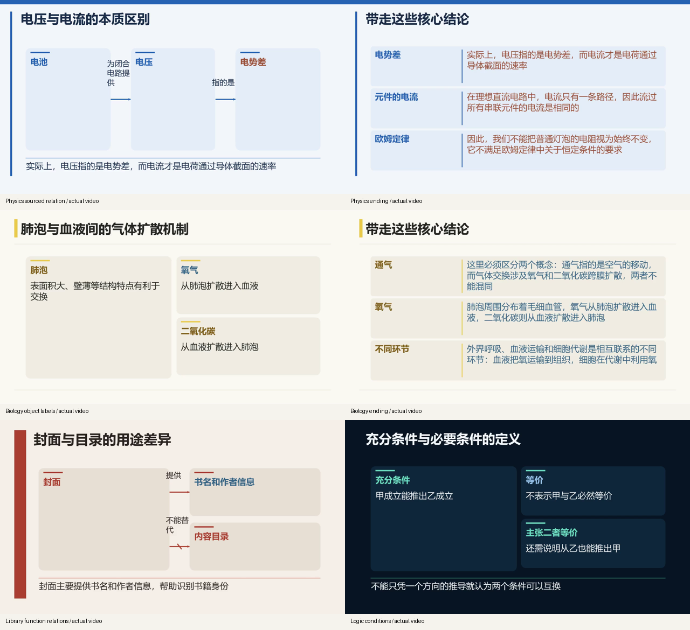

# 简洁图示、路线与结尾验收

日期：2026-10-10。本轮针对用户指出的文字画面退化、残留“25 带走三句话”目录页及首尾结构问题。

## 原因与修复

| 观察到的问题 | 原因 | 已实现的修复 |
| --- | --- | --- |
| 全文堆成文字栏 | 完整讲稿绑定被用于全文上屏，分组路径绕过已有图示 | 原句保留为审查依据，单独规划短说明、实例、表格与关系 SVG。 |
| 节点只写“记住”“不止”等 | 模型将动作片段当对象名，同模型语义审查仍可能放过 | 通用词项及语法边界校验，完整操作名、属性名与单字术语保留，错误草稿重新规划。 |
| 错误箭头 | 同句共现、跨分句或未解析代词被误当关系 | 候选端点、关系词须按同分句顺序支持，名词共现不能当谓词；独立命题形成链条或分支，独立事实保留对照。 |
| 目录留下孤立第25项 | 每个片段标题都进入导航分页 | Agent 选择最多三个主题分界和主题名，程序展开全部连续编号；最多四组，没有漏项或重复；较长课程至少两/三个不同主题，并逐组复核主题与实际片段是否相符。 |
| 结尾列标题或课程介绍 | 自动回顾直接重用页面标题/首个对象 | Agent 选择完整知识句子并独立复核；画面仅移除句首枚举/转折衔接，原句完整保存，拒绝项保留记录。 |
| 分支箭头穿过卡片或伸到边外 | 只根据节点顶部高度差改用底部端点 | 按真实盒子的水平/垂直位置选择端点，宽源节点与短分支从侧面连接。 |
| PPT、视频首尾不同 | 导航页只在 PPT 导出 | 共享封面及结尾，视频增加 3+5 秒有意静音，原有讲稿仅播放一次。 |

画面最多 150 字，包括必要条件和关系词；标题约36–44 pt，正文至少24 pt、关系标签至少20 pt。实际字体计算用于拒绝越界或调整构图。素材仍是辅助配图，不替代知识图示；数学场景和已有连续动画优先。

## 验证范围

使用保留的真实课程讲稿、原素材规划与已有声音，重新调用本机 `qwen3.5:9b` 规划简洁图示、实例、来源关系和结尾；没有为每份教材手写本轮分镜，也没有重做全文提取或配音。模型依据本机推理配置工作，实际阶段与调用记录保存在 `model-calls.json`。

验证输入包括机器学习、原创电路、原创呼吸系统、原创条件逻辑和原创图书检索，覆盖四种模板。它们已参与过开发，属于跨领域开发回归，不是独立盲测。机器学习私人教材与全部产物留在忽略的 `data/`，没有发给云模型或提交 Git。

## 实际失败与迭代

- 结尾分类曾将周围口播中的学习指令算进知识句，缩小为选中的原句；图书功能说明又被误认作本课导航，复核加入课程标题并区分知识对象与课堂指令。
- 电路关系提取耗尽 3072 推理 token，没有接受截断正文；普通画面另用最多四项的直接提取，再进行来源与关系复核。
- 模型重交同一被拒草稿，修复契约排除被拒对象与来源句组合；必要时保留已核对要点、删除错误卡片，再对缩减的整页重新审核。
- 无问号的“如何…”路线句曾被改成事实箭头；疑问来源不再允许断言型连线。谓词不能跳过中间实体来连接另一个对象，重复拼入谓词末尾的宾语按原文边界去重并记录原稿。
- 三片段课程也曾连续三次把编号分入多个主题；分组改成选择分界与主题名，连续编号由程序展开。
- 实际生物帧显示名词被用作关系标签、连线从大框底部伸出；新增有依据的同分句端点顺序及分支端点检查。
- 通过稿仍曾重复长表格释义或截在“安全与”；追加去重和语法结尾检查。相同短值仍可用于真实记录。
- 图示节点“电池”曾因空说明被误拒，尽管其作用已写在连线上；复核契约区分对象身份与关系断言，并提供节点的实际相邻连线，不要求重复塞入正文。
- 同句提到的灯泡曾错误贴到电池节点旁；素材优先绑定画面可见的对象，关系图不再依靠同句共现贴图。否定、条件与结论不会因删除“第三，”“但是，”等开头衔接词而删掉，结尾保留 `source_sentence` 和显示文字两份记录。

## 实际结果

| 输入 | 模板 | 片段 / PPT页 | SVG部件 | 有关系箭头的正文页 | 正文最多字数 | 完整视频 |
| --- | --- | --- | --- | --- | --- | --- |
| 机器学习 | editorial | 25 / 31 | 32 | 3 | 90 | 515.72 秒 |
| 原创电路 | academic | 5 / 9 | 8 | 1 | 68 | 92.27 秒 |
| 原创呼吸系统 | paper | 3 / 8 | 6 | 1 | 69 | 65.89 秒 |
| 原创条件逻辑 | classic | 3 / 7 | 4 | 0 | 70 | 68.49 秒 |
| 原创图书检索 | editorial | 3 / 7 | 6 | 1 | 88 | 86.83 秒 |

- 全部自动测试：**606 通过，0 失败、0 错误**，耗时 122.17 秒；1条 httpx/TestClient 弃用提示。最终 XML 与日志位于 `data/story-repair/`。
- 五份 PPTX 的 ZIP/CRC 通过，完整 MP4 视频与音轨可解码；全部普通正文及封面/结尾的实片与共享页对比通过，平均像素误差最大 2.334（0–255，阈值5）。
- 每份仅一个路线页，均有封面和独立结尾；正文讲稿播放一次，视频另有8秒有意静音。普通正文按要点渐进出现，原有两段机器学习连续场景保留。
- 实际查看全部正文抽帧总览、封面和结尾；已修正截断节点、图内标签颜色、分支端点及同句实体错误配图。机器学习实例页保留西瓜插画，完整成片约8分36秒。
- 安装包检查通过：109个SVG/PNG素材、两个新模块与核心jieba依赖齐全，无本机配置或数据文件。



本轮验收通过的是上述输入的画面工程和媒体回归。标题分类、知识断言与关系检查保留各自记录，并不证明所有原讲稿正确，也不代表达到NotebookLM的整体视觉水平。逻辑课没有获得可信的关系箭头，保留条件说明；多数正文仍使用概念卡与对照，插画类型覆盖仍有限。


## 复现

```powershell
.\.venv\Scripts\python -m pytest
.\.venv\Scripts\python scripts/verify_slide_story.py --case all
# 已有通过复核的规划：只重绘与检查媒体，不调用模型
.\.venv\Scripts\python scripts/verify_slide_story.py --case all --render-only
```

第二条命令需要本机保留的五份基线任务及 Ollama，普通克隆仓库不包含私人课程。新输入可通过网页使用同一规划与渲染流程；完整图稿、拒绝记录、路线和结尾位于任务的 `slide-story/`。

## 边界

本轮不证明原讲稿所有知识正确，不改变数学教材联合验收状态。已有两段机器学习连续场景继续使用先前媒体，不算本轮新自动数学动画通过。预览为共享版式绘制及实际 MP4 抽帧，尚未进行 PowerPoint 应用放映或完整人工音频听辨。封面与结尾有意静音，正文配音没有重复生成。

路线分界必须显式输出，缺失字段不能默认为空列表；主题与本组实际标题/知识对象再单独核对，复核不通过时整条路线重新规划。拒绝项保存在 `navigation-attempts.json`。修复保留已经核对的分界及主题，只重写被拒主题，再进行整条路线复核；路线复核使用有界直接分类，预算2048输出 token。一次启用推理的尝试耗尽4096输出 token，明确失败而未发布；改为直接分类契约后重新验证，不接受截断输出。

路线布尔复核也曾要求标题列出每个例外和细节，导致合理主题反复被拒。改为“准确概括/相关概括/误导/不相关/矛盾”的分类契约：普通相关例子和适用边界无需逐字进入导航标题，指向错误主题和矛盾标题仍拒绝。这项标题检查不代替正文知识、条件和关系的逐项复核。
