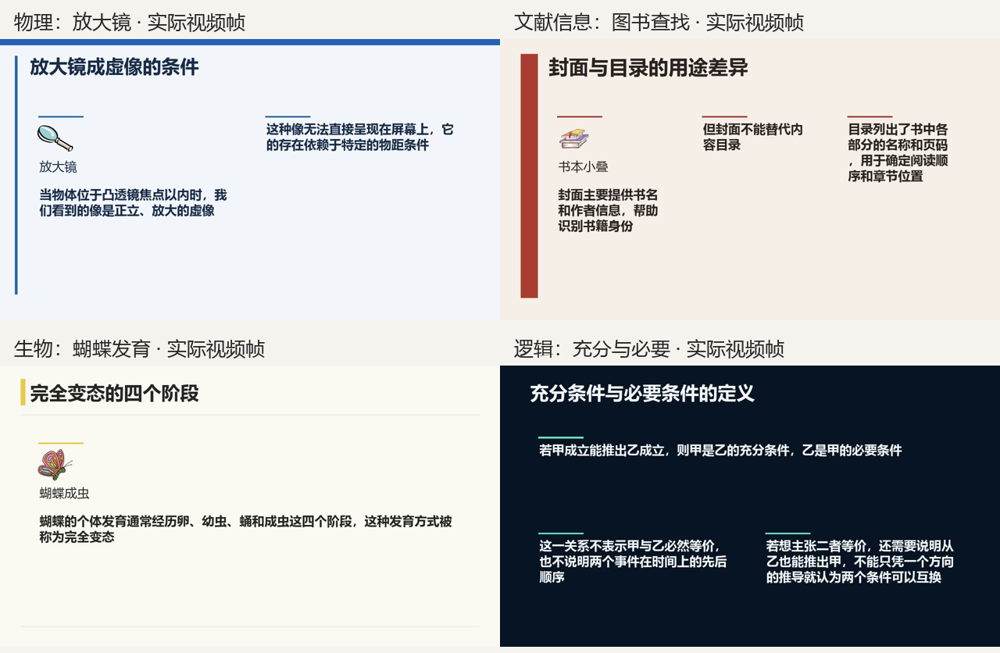

# 素材库与共享画面验收（2026-10-10）

## 结论与范围

素材检索、对应要点的小配图、讲稿句子绑定、四种模板及 PPT/MP4 共用正文画面已完成本轮工程验收。八份输入均导出 PPT 与完整视频；这不是八本整书或八组数学教材的联合质量通过。机器学习复用已有核对讲稿和配音，另外七份使用原创短资料。金融资料仍有核心数值例子和风险内容未进入已生成讲稿的问题，不能标为教学完整性通过。

四份新资料最初未用于机器学习排版调试，输入哈希与统一提示词在运行前冻结。它们随后发现并参与通用修复，最终结果属于新资料开发回归，不是独立盲测。所有画面选择使用本机 `qwen3.5:9b`，没有手工指定这些输入的素材 ID，也没有按教材名字编写运行时分支。没有将私人教材或参考声音发送给云模型。

## 实际工程检查

- 全部软件测试：**546 passed，1 warning，109.27 秒**。日志 `data/visual-assets/final-release-tests.log`，机器结果 `final-release-tests.xml`。警告为 Starlette/TestClient 的 httpx 弃用提醒。
- 安装包：109 个 SVG、18 份各级 README；目录引用逐字节对应，ZIP CRC 正常，包含 `caption_grounding.py`。清单 `data/visual-assets/final-package-check.json`，Wheel SHA-256：`ba7c47f6d507d510c86960f706b12d4b6d547282a64deb682293eff2d032d14c`。
- 素材指纹：`e49fb51c6523691c53fb371c7aff3c75c3c457b141086d4ea85ca1c94e5c50dd`。100 个原创 MIT 线条符号、9 个有出处的 CC0 手绘条目；其中两幅书图来自同一原作。每个 SVG 的透明渲染、内容非空与元数据引用通过软件测试。
- 实际八份输出中，配图区域占一页的最大比例 **1.81%**；未发现同页重复素材 ID。四种模板、多 SVG、文字字号/边界、备注和动画保存还有独立回归。
- 完整视频全部解码；源配音非静音，成片音频与全部源讲稿时长匹配。48 个普通片段的实际末帧与 PPT 共用页面比较，最大平均像素误差 **1.902 / 255**，低于 H.264 容差 5。每段讲稿仅进入完整视频一次。
- 网页原创演示任务 `ce5b2413995e4ed1a96521931e3741a1`：实际上传、授权、非默认杂志模板、配图、来源展开、视频播放及 PPT/MP4 下载入口可操作，89.6667 秒视频可播放。截图 `data/illustration-webqa/handdrawn-web-result.png`。它使用规则内容与 Windows 系统配音，不能标为 AI 内容端到端生成。

受限权限下最初一次 pytest 因临时目录访问失败未计为通过；正常本机权限重新执行。安装包核对脚本第一次误用属性失败后修正并实际通过，失败日志未删。未进行 PowerPoint 应用放映、完整逐字人工听辨或对任意长教材的覆盖验收。

## 实际输出

| 输入 | 模板 | 讲解段 / PPT 页 | MP4 秒 | 不同配图数 |
| --- | --- | --- | --- | --- |
| 机器学习（已有内容基线） | `editorial` | 25 / 42 | 507.71 | 4 |
| 物理：电路 | `academic` | 5 / 9 | 84.26 | 1 |
| 金融：计息 | `editorial` | 3 / 7 | 26.93 | 0 |
| 生物：呼吸 | `paper` | 3 / 8 | 57.89 | 1 |
| 物理：放大镜 | `academic` | 4 / 8 | 87.09 | 2 |
| 文献信息：图书查找 | `editorial` | 3 / 7 | 78.83 | 1 |
| 生物：蝴蝶发育 | `paper` | 4 / 12 | 76.60 | 1 |
| 逻辑：充分与必要 | `classic` | 3 / 7 | 60.49 | 0 |

四份新资料的真实视频帧：



- 机器学习（已有内容基线）：`data/illustration-acceptance/ml/`，包含 `lesson.pptx`、`lesson.mp4`、`presentation-plan.json`、`acceptance.json`、`video-review-*.png`。
- 物理：电路：`data/illustration-acceptance/subjects/jobs/jobs/b3051e72ec47420c854e629776c0d5cb/`，包含 `lesson.pptx`、`lesson.mp4`、`presentation-plan.json`、`acceptance.json`、`video-review-*.png`。
- 金融：计息：`data/illustration-acceptance/subjects/jobs/jobs/fc93c2bb876c4eed912d2dbcfb0b4fad/`，包含 `lesson.pptx`、`lesson.mp4`、`presentation-plan.json`、`acceptance.json`、`video-review-*.png`。
- 生物：呼吸：`data/illustration-acceptance/subjects/jobs/jobs/9e24603497ed4e9ebcc1bd45b7d67e29/`，包含 `lesson.pptx`、`lesson.mp4`、`presentation-plan.json`、`acceptance.json`、`video-review-*.png`。
- 物理：放大镜：`data/visual-generalization-v2/jobs/jobs/4e04c18ef95c426aa982a1473c6a7c07/`，包含 `lesson.pptx`、`lesson.mp4`、`presentation-plan.json`、`acceptance.json`、`video-review-*.png`。
- 文献信息：图书查找：`data/visual-generalization-v2/jobs/jobs/255d120dd0db4be68fe84f93df99e769/`，包含 `lesson.pptx`、`lesson.mp4`、`presentation-plan.json`、`acceptance.json`、`video-review-*.png`。
- 生物：蝴蝶发育：`data/visual-generalization-v2/jobs/jobs/ebbda17da5b6434a8139ecb9d0a4367b/`，包含 `lesson.pptx`、`lesson.mp4`、`presentation-plan.json`、`acceptance.json`、`video-review-*.png`。
- 逻辑：充分与必要：`data/visual-generalization-v2/jobs/jobs/e3730175013b4a2db08e14f81b6fd7a4/`，包含 `lesson.pptx`、`lesson.mp4`、`presentation-plan.json`、`acceptance.json`、`video-review-*.png`。

每份 `acceptance.json` 记录最终 PPT/MP4 SHA-256、配图 ID、音频时长和逐段比较。上述 `data/` 为本机忽略目录，产物没有随源码公开发布。

## 内容与配图人工复查

| 输入 | 查看实际帧与已有讲稿的观察 | 限制 |
| --- | --- | --- |
| 机器学习 | 西瓜、笔记本插画及相关符号由模型选择，按相关实例小幅呈现；采用非默认杂志模板。 | 复用内容基线，不能证明从私人 PDF 重新完成全部知识规划。两段已核对的表格筛选与连续曲线媒体为显式导入测试场景。 |
| 电路 | 保留电压/电流区别和条件；配图只用于识别对象。 | 不把通用电路符号作为串并联实验或数值关系正确性的证明。 |
| 计息 | 已有讲稿中的单利、复利定义与固定教学假设保留。 | 源资料的 105、110.25 数值实例及风险限定未完整进入知识/讲稿结果，教学完整性不通过。此次画面绑定不会凭空补回缺失讲稿。 |
| 呼吸 | 整肺插画标为肺部，不能用肺泡作为整幅图名；细胞与肺的对象身份分开。 | 没有按解剖标准验收肺泡细节，也没有真实气体机制动画。 |
| 放大镜 | 实际画面保留焦点内、虚像、位置条件，放大镜与书本小图跟随相关要点。 | 本轮为基础配图，不是经过计算的光线传播演示。 |
| 图书查找 | 封面、目录、查找和借阅的用途分开；同页只有一幅书本小图。 | 部分口播解释重复，仍可进一步做叙事编辑。 |
| 蝴蝶发育 | 卵/幼虫/蛹/成虫及环境条件在文字中保留，图明确标为蝴蝶成虫。 | 缺少卵、幼虫和蛹的配套插画，未用一张成虫图冒充完整发育比较。 |
| 充分与必要 | 最初画面短句反转方向，最终改为逐字取用正确讲稿的完整句子；抽象逻辑选择零插画。 | 程序没有证明所有推理正确，只约束画面不再次改写口播。 |

## 发现、修复和记录

1. 图书新资料的大纲改写/遗漏知识点标题：输出标题限制为原始 Literal，核对输入各标题次数；服务失败不转演示。`tests/test_course_outline_contract.py`。
2. 一个候选被同页放三次，蝴蝶也出现重复：候选数量进入原生输出契约；真实模型重试通过，不静默丢掉坏字段。拒绝稿见任务中的 `presentation-plan-attempts-before-retry-*.json`、`layout-attempts-before-refresh-*.json`。
3. 相关概念冒充同一对象：检索 tags 与 entity_aliases 分开，图片标签用实际所画对象；英文词边界防止 NotebookLM 被当作书。素材元数据可扩充，没有教材专用关键词分支。
4. 正确口播被压缩成错误画面短句，或额外片段丢掉“误解”限定：`caption_grounding.py` 与导演的补充文字都只取完整现有讲稿句子，保持逗号/分号内的前提、否定和方向。原画面及选择见各任务 `caption-grounding.json`。模型失败明确拒绝，所有批次通过后才修改课程。
5. 透明背景、多 SVG 包装、残句续页和末帧持续时间：共享页面和 alpha 渲染、图片逐项绑定、整句重排及末帧保持，保留连续数学窗口。

原始失败和中断仍保留在 `data/visual-generalization-v2/` 的输入冻结、执行历史和重试结果中。最新版成功不改写旧失败，也不将修复后的输入再称为未见资料。

## 配音、复现与边界

机器学习和三领域初始实际生成使用本机 Qwen3-TTS 0.6B 参考声线；后续只重排画面，复用同一讲稿配音。机器学习和生物保留原始 PCM；电路和计息的历史中间 WAV 已清理，重排前从既有 AAC 恢复为 PCM，`audio-evidence.json` 明确注明，不称为原始 WAV 或重新合成。四份新资料使用 Windows 系统语音，明确不是 AI 配音。

```powershell
.\.venv\Scripts\python -m pytest
.\.venv\Scripts\python scripts/index_visual_assets.py --check --rebuild --contact-sheet
.\.venv\Scripts\python scripts/verify_visual_assets.py --case all
.\.venv\Scripts\python scripts/verify_visual_generalization.py --output data/visual-generalization-v2 --refresh-catalog
```

机器学习验收需要本机已存在的 `data/ml-editorial/` 内容基线，不随源码提供私人资料；七份原创资料可由脚本重新创建。模板、素材与文字绑定是通用代码；九个手绘条目不足以覆盖全部学科，未匹配时保留知识画面并记录缺口。后续需要补充素材与独立新资料验收，不能据这八份媒体推断整书教学完整性、自然听感或 3Blue1Brown 级数学动画。
