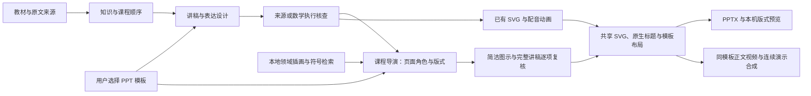

# 课程导演与 PPT 模板

更新：2026-10-10。此页区分已接入的首版与后续设计，不把模板导出成功等同于 NotebookLM 教学效果。

## 1. 参考视频的实际观察

用户提供的视频时长约 450 秒，960×544、22 fps，包含 AAC 音频。本次在本机每 12 秒抽帧，并放大核对问题页、原文页与关键解释页；没有进行完整音频听辨。因此下面描述的是可观察的画面与叙事结构，不评价音色或整段口播同步。

| 时间附近 | 观察到的表达 | 本项目的设计要求 |
| --- | --- | --- |
| 0–36 秒 | 标题、核心问题、五部分路线 | 先给学习问题与课程路线。 |
| 48–84 秒 | 日常例子、问题句、定义重点 | 例子服务当前概念，画面提示词与讲稿分开。 |
| 96–144 秒 | 章节提示、教材截图、两类对象对比 | 根据内容选择图文分栏、原图或比较，不统一画流程图。 |
| 156–216 秒 | 假设空间与版本空间的来源图示 | 保留真实来源及对象身份，逐步说明筛选含义。 |
| 228–312 秒 | 提问、概念页、条件与结论的解释 | 概念卡用于提出问题，原文限定不能因画面简洁而省略。 |
| 324–444 秒 | 时间线、应用、结尾问题 | 时间顺序须有来源；结尾引导复述与迁移。 |

原片以图文幻灯片和切换为主，不是连续数学构造的替代品。其没有免费午餐定理画面简化了前提；所附教材第 9 物理页明确讨论问题等权与目标函数均匀分布。参考风格不意味着照搬简化后的知识表述。

素材只在本机读取，原 PDF、视频、抽帧与文字未提交 Git，也未发给云模型。本文不含原片图像、长段教材或克隆音色。

## 2. 当前 Agent 流程



模板说明参与教学规划提示词；独立版式阶段再读取已核验的课程，选择页面角色、已声明版式、已有短句编号与是否增加动画页。该阶段不重写事实、不提供路径、不生成 XML、SVG 或可执行代码。其输出保存在任务目录的 `presentation-plan.json`；拒绝和修复记录在 `presentation-plan-attempts.json`。

每批最多六个片段，解码契约按真实片段编号和已有短句编号生成，拒绝编号重复、遗漏、非法版式。模型失败最多修复三次，服务错误继续明确失败。完整课程顺序由程序保留。数学推演必须使用大幅画面并保留已有连续动画，不能为省页数删掉推演。非数学定义可以只用图文页，不再机械地给每个片段增加动画页。

新模板课件包含封面、引入问题、课程路线、内容页、按需要加入的动画页与结尾。Agent 将路线归并为最多四个连续主题，完整覆盖片段顺序；结尾选择一至三条完整知识句子并独立复核，避免把全部标题逐条重复。问题沿用已有场景问题；没有场景时使用基于当前标题的理解提示，不新增知识断言。

`slide_story.py` 单独规划画面对象、短说明、实际字段与值和关系；完整讲稿只作复核依据，保留在网页和备注。对象与关系绑定完整句子，先检查词项、分句与身份，再逐项检查语义。独立命题形成连通关系时可画链条或分支，独立定义保留比较，具体记录优先用表格。拒绝的替代图写入记录，沿用先前已复核的画面；模型服务失败仍会报错。`story_svg.py` 负责坐标、字号、自动换构图、方向与渐进呈现，不执行模型 SVG 或代码。

普通画面显示文字最多 150 字（包括必要条件和连线），实际拥挤时拒绝或调整构图，正文至少 24 pt、连线标签至少 20 pt。已有数学/连续场景优先显示，不被卡片或素材替换。封面和结尾同时进入 MP4，分别静音停留 3 秒和 5 秒，讲稿仍仅播放一次。新版规划与旧文件兼容；旧文件需要重新生成才会改变。

## 3. 四种内置模板

| ID / 网页名称 | 实际版式 | 当前作用 |
| --- | --- | --- |
| `classic` / 深色演示 | 既有深色大图和独立动画页 | 兼容旧任务及既有导出。 |
| `paper` / 纸上讲解 | 暖白纸面、黄色重点块、图文分栏、图下注释或原文边栏 | 适合问题引入与通俗解释。 |
| `academic` / 学术课堂 | 蓝白标题层级、证据边栏、条件提示与大图 | 适合课堂讲解与来源核对。 |
| `editorial` / 杂志叙事 | 红色章节带、较大标题、知识重点与辅助配图 | 适合报告、回顾与章节叙事。 |

模板改变 PPT 和完整 MP4 的正文布局与配色，配图绑定对应实例和要点；普通页面素材区域合计不到 8%，让知识内容占主体。数学图与动画本身沿用原场景，在模板窗口内按比例播放，保留公式、对象身份与颜色语义。当前有 100 个原创领域符号和 9 个有出处的 CC0 手绘插画，详见[素材库与共享画面](素材库与共享画面.md)；尚未支持上传任意 `.pptx`、母版解析或运行时自由生成插画。

标题为 PowerPoint 原生文字；新版简洁图示内的短句与连线是可编辑 SVG 文字，图示保留 SVG 和透明 PNG 兼容图，同页支持多个 SVG。正文至少 24 pt，标题 36–44 pt，过长的内容调整构图，完整讲稿与出处放在备注中。画面移除品牌、模式、技术标签和来源脚注。普通内容按要点逐步呈现，数学和通用场景保留有声连续动画。独立导出缺少配音的状态记录在清单与备注中。

网页提供模板选择和版式示意，失败重试保留选择或允许更换。旧 API 和旧任务未设置该字段时使用 `classic`；网页新任务默认选择 `paper`。

## 4. 复现与证据

完整回归和实际导出记录见[验证与验收](验证与验收.md)。模板功能不改变[八组数学教材的联合验收状态](math-repair-acceptance-2026-10.md)。

```powershell
.\.venv\Scripts\python -m pytest -o addopts='' -q
.\.venv\Scripts\python -m scripts.verify_ppt_templates --lesson <已有课程.json> --assets-dir <原任务目录> --output data/template-check --model <本机模型>
```

该脚本用**同一份已有课程与媒体**实际规划三套模板，检查完整 PPTX、SVG、电影形状、宽高比及视频完整解码。没有重新理解教材，不能据此计入教材泛化或数学质量通过。使用远程模型必须显式加 `--remote-consent`；这会发送已有讲稿与来源引文。

任务的 `presentation-preview/` 保存原生布局绘制的 PNG 和清单，供本机检查字号、边界和画面比例；它不是 PowerPoint 自身的渲染结果。OOXML、PNG 和解码检查不能替代完整试听或 PowerPoint 放映验收。

## 5. 后续设计

以下尚未接入：章节级问题链和可编辑导演稿、按语句精确绑定的视觉焦点时间轴、运行时自由生成插画、封面/转场/回顾独立配音、任意用户模板的母版约束、人工审稿停点与发布状态。来源图与本地原创插画已分别管理，插画检索记录可查看；后续能力应在现有来源与执行约束上逐项实现。
